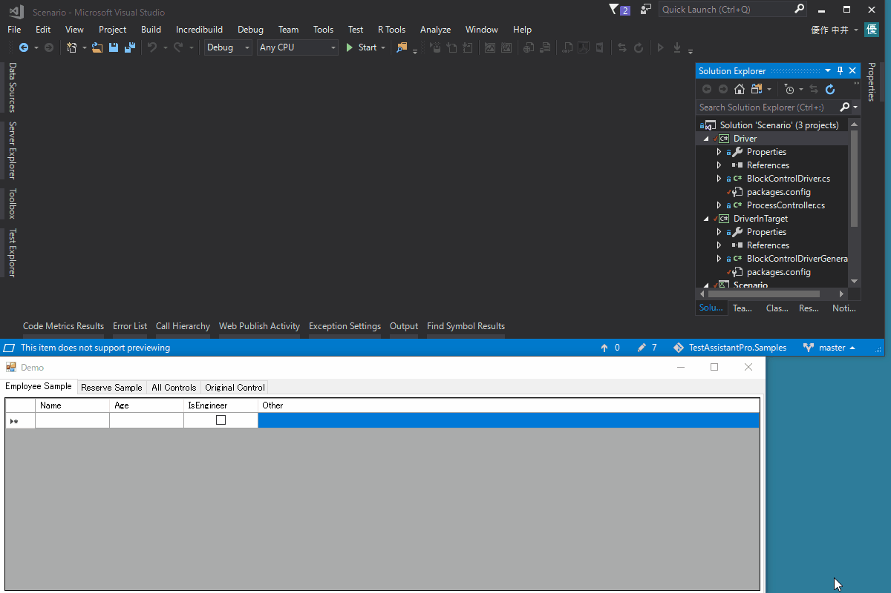
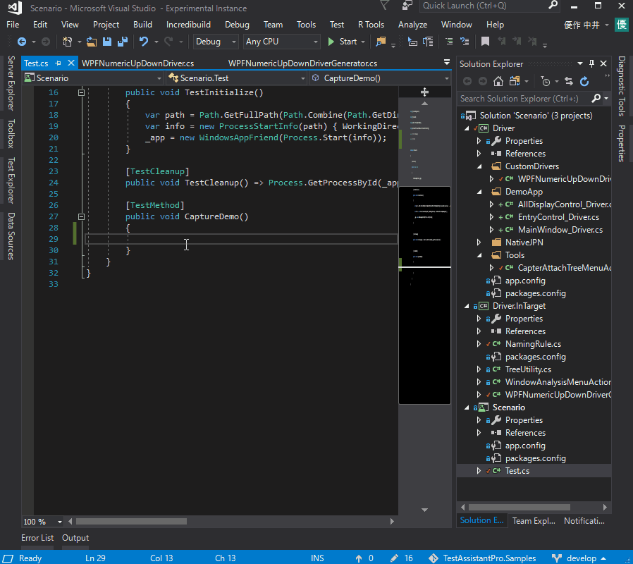
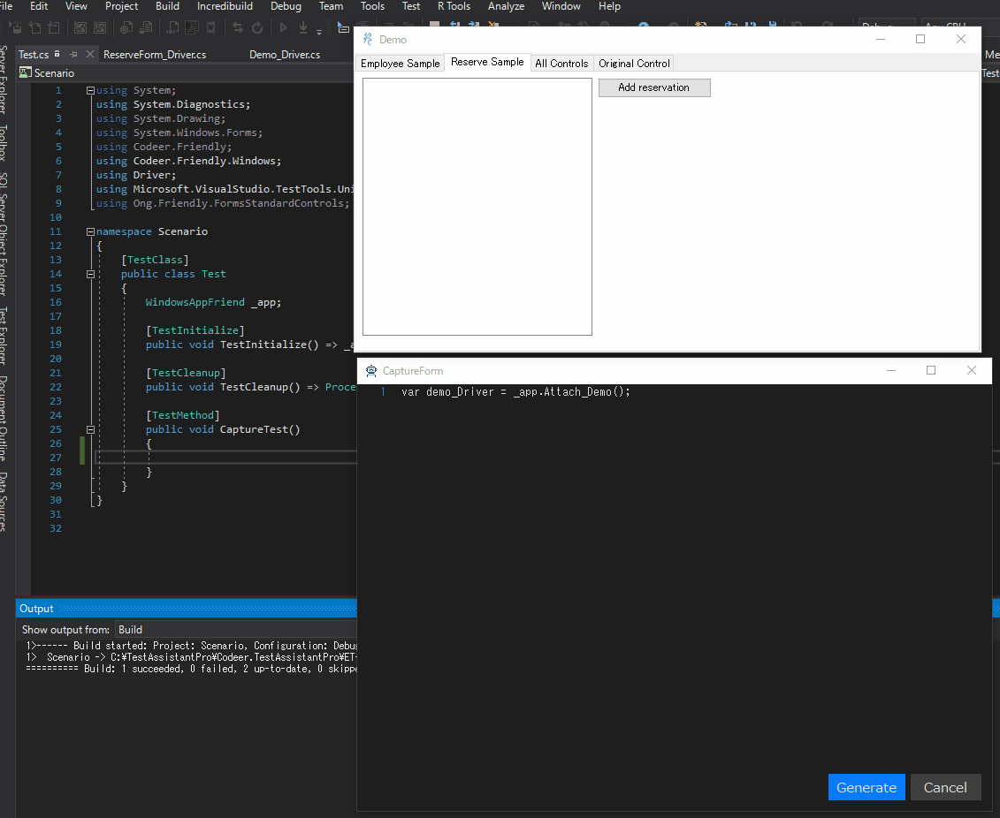
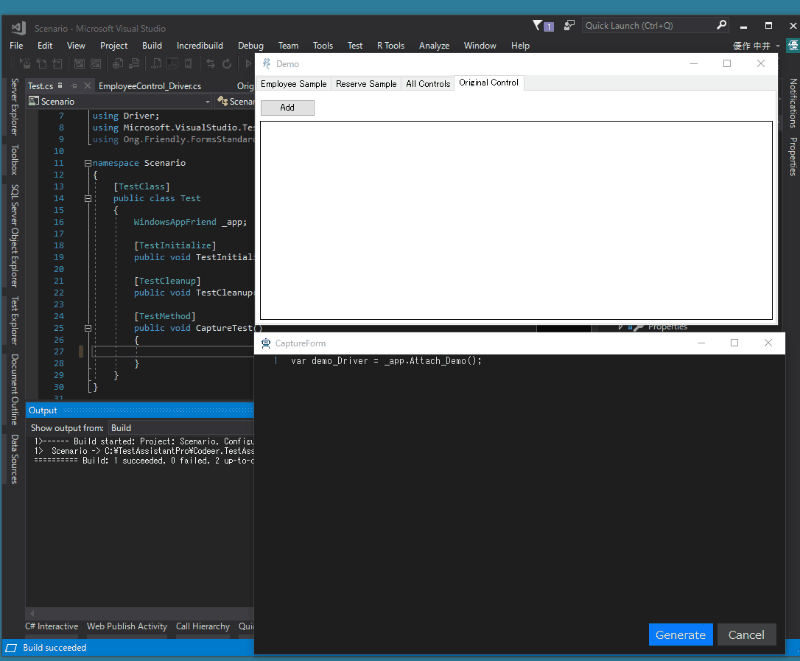
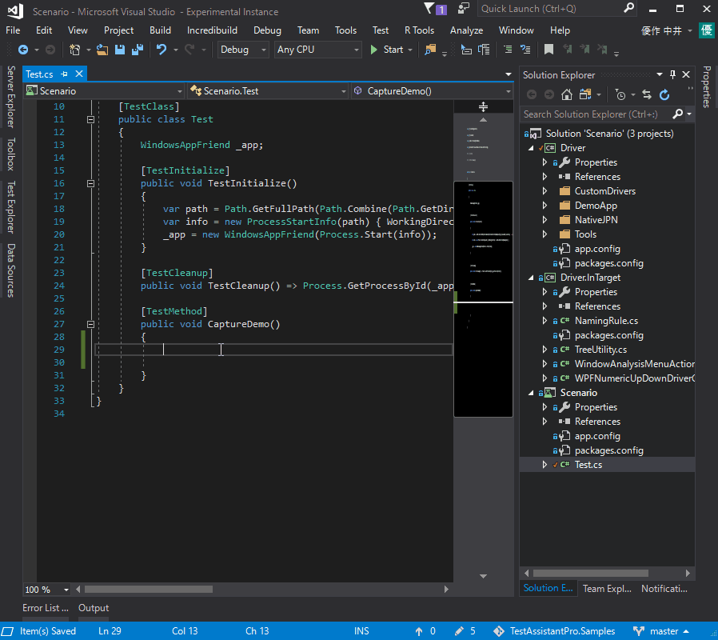

# TestAssistantPro.Samples
It is a sample you can learn how to use TestAssistantPro.

For Japanese: [日本語](https://github.com/Codeer-Software/TestAssistantPro.Samples/blob/master/README_JP.md)

Download form Visual Studio Marketplace  
-------------
[Test Assistant Pro](https://marketplace.visualstudio.com/items?itemName=Codeer.TestAssistantPro "Title")

How to use samples
-------------
[for WinForms](https://github.com/Codeer-Software/TestAssistantPro.Samples/tree/master/WinForms "Title")
 
[for WPF](https://github.com/Codeer-Software/TestAssistantPro.Samples/tree/master/WPF "Title")

Status
-------------
<table>
<tr>
  <th></th>
  <th align="center">Win32</th>
  <th align="center">WinForms</th>
  <th align="center">WPF</th>
</tr>
<tr>
  <td align="center">Status</td>
  <td align="center">?</td>
  <td align="center">?</td>
  <td align="center">?</td>
</tr>
</table>

Summary 
=============

Synergy effect of Code and Tool
-------------
Automatic test creation is software development itself. Sharpened design / implementation is essential to succeed. It does not change.
TestAssistantPro highly assisted implementation of Automatic Test recommended by Codeer.
You can use it as an extension of VisualStudio.

The automated test code recommended by Codeer
-------------
The automated test code recommended by Codeer is divided between the driver layer and the scenario layer. Technical processing is left to the driver layer, keeping the scenario which becomes the test simple is simple.
With TestAssistantPro you can generate test scenario code using the driver. It uses already implemented code to generate better code.

Auto Generate Driver
-------------
Most of the drivers can be generated automatically.
When the code is selected, the corresponding control is displayed in red frame.
By using the refactoring function of VisualStudio together, people can easily maintain Driver.

 

Auto Generate Scenario
-------------
TestAssistantPro generates code that reproduces the operation you performed by capturing the actual application operation.
The generated code is an operation code that is superior in reliability and readability, achieves high operating speed, and it is an excellent code that can be used as it is as a test scenario.

 

Moreover, flexible customization is possible. It is very easy to insert code that performs expected value checks with the check method specified during capture.

 

Synchronized code is output neatly even in the modal dialog.

 

Also supports special control.
-------------
In many cases, Windows applications use standard controls, as well as third-party and unique controls in their respective projects. Even in such a case, you can keep the test scenario simply by creating the corresponding control driver.
Also, by implementing a code generator corresponding to the control driver, it is possible to use the code generation function of TestAssistantPro even with its own control.

 

 
