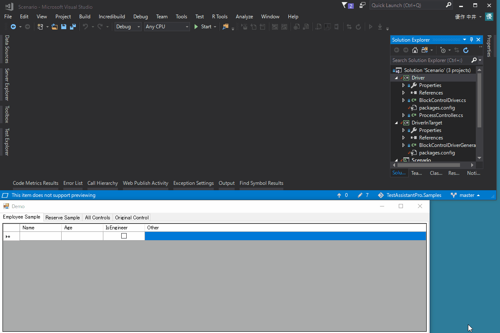
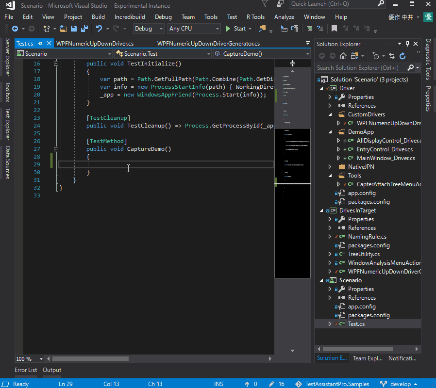
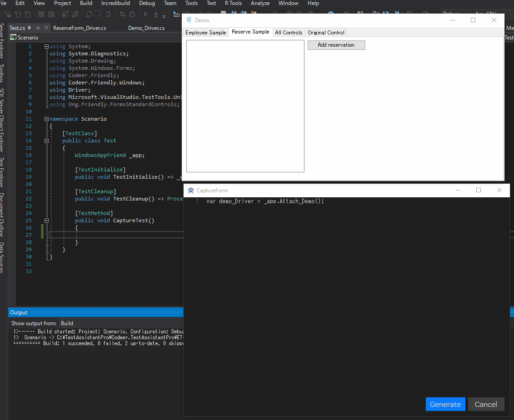
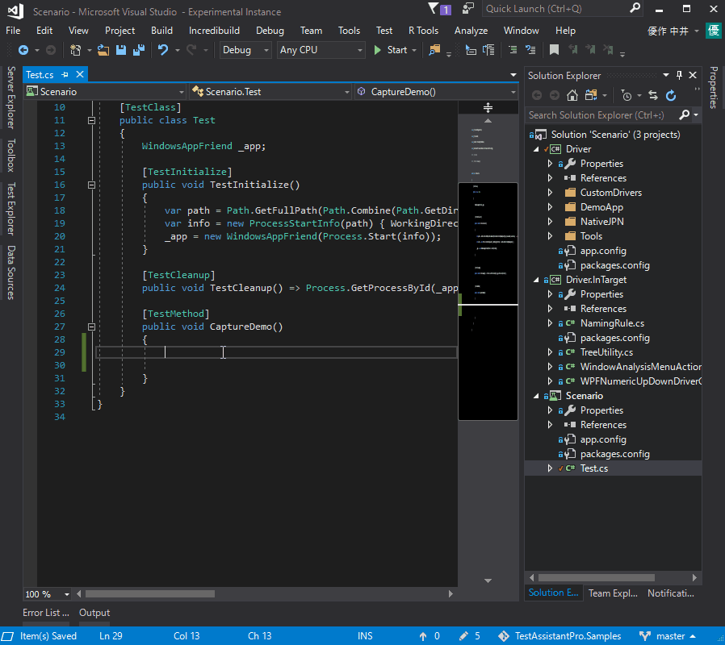

# TestAssistantPro.Samples
TestAssistantProを知るためのサンプルです。

Visual Studio Marketplace からダウンロード
-------------
[Test Assistant Pro](https://marketplace.visualstudio.com/items?itemName=Codeer.TestAssistantPro "Title")

フレームワーク毎のサンプル
-------------
[for WinForms](https://github.com/Codeer-Software/TestAssistantPro.Samples/tree/master/WinForms "Title")
 
[for WPF](https://github.com/Codeer-Software/TestAssistantPro.Samples/tree/master/WPF "Title")

対応状況
-------------
<table>
<tr>
  <th></th>
  <th align="center">Win32</th>
  <th align="center">WinForms</th>
  <th align="center">WPF</th>
</tr>
<tr>
  <td align="center">対応済み</td>
  <td align="center">〇</td>
  <td align="center">〇</td>
  <td align="center">〇</td>
</tr>
</table>

概要 
=============

コードとツールのシナジー
-------------
自動テスト作成はそれ自体がソフトウェア開発です。成功に導くには研ぎ澄まされた設計/実装が不可欠です。それは変わりません。 TestAssistantProはCodeerが推奨する自動テストの実装を高度にアシストいたします。
VisualStudioの拡張としてご利用いただけます。

Codeer推奨の自動テストのコード
-------------
Codeerが推奨する自動テストのコードはドライバ層とシナリオ層が分かれています。技術的な処理はドライバ層に任せて、テストの肝となるシナリオをシンプルに保ちます。
TestAssistantProを使えば、ドライバを使ったテストシナリオコードの生成ができます。すでに実装されたコードを使って、より良いコードを生成するのです。

ドライバ生成
-------------
ドライバの多くは自動で生成できます。 また、ツリー上でコントロールを選択するか、ドライバ生成時のコードビューワ上のプロパティがある行にカーソルを置くと、対応するコントロールが赤枠で表示されます。 対象のコントロールが赤枠で表示されます。 VisualStudioのリファクタリング機能を合わせて使うことにより人が簡単にDriverのメンテナンスをすることができます。

 

シナリオ生成
-------------
TestAssistantProは、実際のアプリ操作をキャプチャする事で、行った操作を再現するコードを生成します。
生成されたコードは、信頼性・可読性に優れ、高い動作速度を実現した操作コードであり、テストシナリオとしてそのまま使う事の出来る優れたコードとなっています。

 

また、柔軟なカスタマイズが可能となっており、例えば指定したチェック方法を用いた期待値チェックを行うコードも、 キャプチャ中にとても簡単に挿入できるようになっています。

 

モーダルダイアログでも同期をとったコードが綺麗に出力されます。

 

特殊なコントロールにも対応
-------------
多くの場合Windowsアプリは標準的なコントロールの他に、サードパーティやそれぞれのプロジェクトで固有のコントロールを使います。そのような場合でも対応するコントロールドライバを作成することによってシンプルにテストシナリオを保つことができます。
また、そのコントロールドライバに対応するコードジェネレータを実装することによって独自のコントロールでもTestAssistantProのコード生成機能を使うことができるようになります。

 

 
