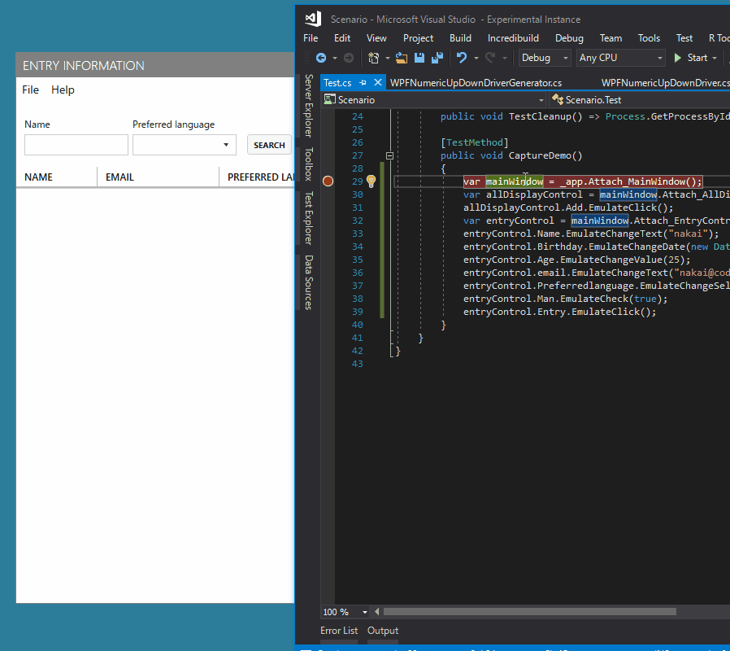
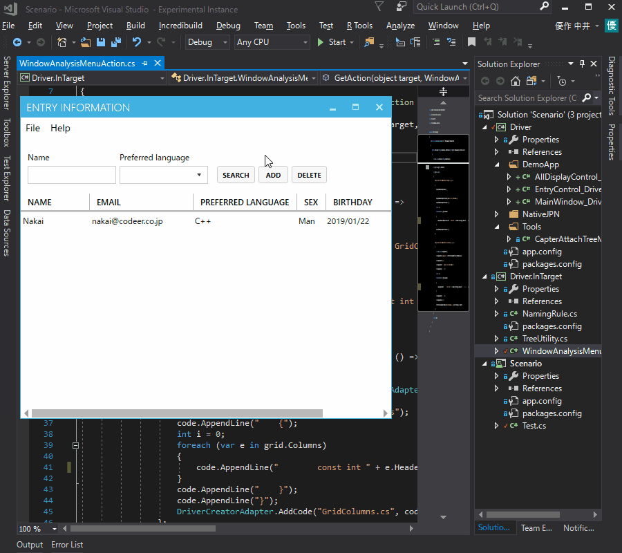
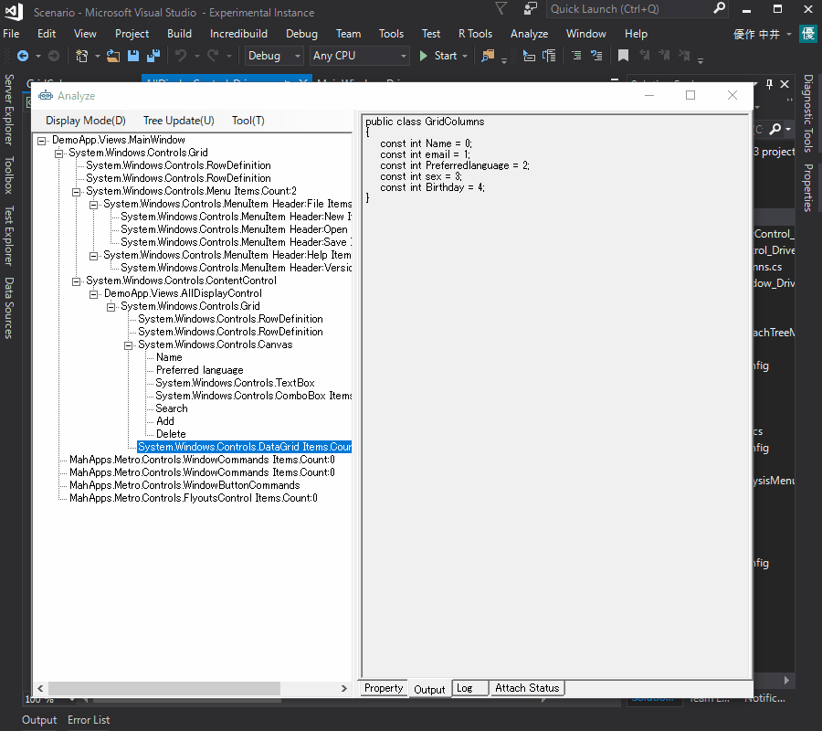
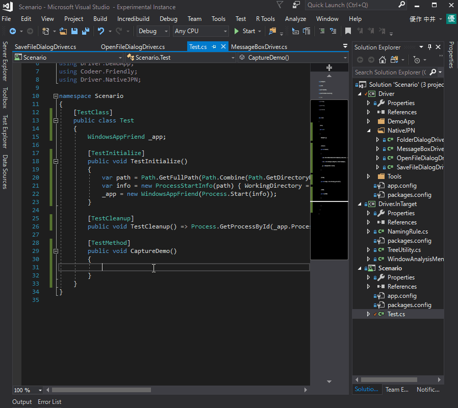

# WPF Sample
It is a sample to experience Test.AssistantPro in the WPF application.

Preparation
-------------
##### 1. Open and Debug build DemoApp/DemoApp.sln
##### 2. Open and Debug build Scenario/Scenario.sln
##### 3. Start DemoApp from DemoApp/bin/Debug/DemoApp.exe

Experience
-------------
### 1. Analyze Window
Right-click on Folder (or Project) in Solution Explorer and execute "Analyze Window".

 

Select the application to be operated. Here, please select "Entry Infomation".

 
 
"Analyze Window" displays all the controls in the currently opened window.
You can check the values and properties of all controls.
If you want, you can change values and properties in "Analyze Window".

 

### 2. Create Driver
You can create a driver for the control you want to operate with "Create Driver" in "Analyze Window".
You can highlight the control corresponding to each line.

 

### 3. Capture
Right-click within CaptureTest function of Test.cs of Scenario project and execute "Capture".
The operation method is generated with the code using the driver.

 
 
### 4. Debug and Execute
Right-click within any function of Test.cs of Scenario project and execute "Execute".
You can execute the function immediately.

 
 
Also, if you execute "Debug" you can debug using VisualStudio's debugger.

 
 
### 5. Customize
Windows applications have various features.
It is impossible to efficiently generate code if it is forcibly handled in a unified way.
Therefore, TestAssistantPro provides several customization functions according to each project.
If you use the customization well, you can achieve highly efficient code generation just fitted to each project.

#### 5.1. Customizing the name when generating the driver
You can customize the name used for each property when generating the driver.
The name created so far is a good name because it has already been customized.
Since the naming convention differs depending on the project in many cases, this is provided in the form of customization.
In WPF, in many cases it would be better to extend this sample to the rules of each project.
In this sample, ContentControl uses the character of its Content.
Also TextBox, ComboBox, Calendar uses nearby TextBlock letters.
For other controls, we use default naming rules.
When string.Empty is returned, the default naming rule is applied.

*Code of the driver generated in a nice touch*
```csharp
[UserControlDriver(TypeFullName = "DemoApp.Views.EntryControl")]
public class EntryControl_Driver
{
    public WPFUserControl Core { get; }
    public WPFTextBox Name => new WPFTextBox(Core.Dynamic()._textBoxName);
    public WPFTextBox email => new WPFTextBox(Core.LogicalTree().ByBinding("Mail.Value").Single());
    public WPFComboBox Preferredlanguage => new WPFComboBox(Core.LogicalTree().ByBinding("Language.Value").Single());
    public WPFToggleButton Man => new WPFToggleButton(Core.LogicalTree().ByType<ContentControl>().ByContentText("Man").Single());
    public WPFToggleButton Woman => new WPFToggleButton(Core.LogicalTree().ByType<ContentControl>().ByContentText("Woman").Single());
    public WPFCalendar Birthday => new WPFCalendar(Core.LogicalTree().ByBinding("BirthDay.Value").Single());
    public WPFButtonBase Entry => new WPFButtonBase(Core.LogicalTree().ByType<ContentControl>().ByContentText("Entry").Single());
    public WPFButtonBase Cancel => new WPFButtonBase(Core.LogicalTree().ByType<ContentControl>().ByContentText("Cancel").Single());

    public EntryControl_Driver(AppVar core)
    {
        Core = new WPFUserControl(core);
    }
}
``` 

*NamingRule.cs*
```csharp
public class NamingRule : IDriverElementNameGenerator
{
    CSharpCodeProvider _provider = new CSharpCodeProvider();

    public int Priority => 1;

    public string GenerateName(object target)
    {
        var name = GenerateNameCore(target);
        return _provider.IsValidIdentifier(name) ? name : string.Empty;
    }

    string GenerateNameCore(object target)
    { 
        if (target is ContentControl content)
        {
            if (content.Content is string) return content.Content.ToString().Replace(" ", "");
        }

        //Get name from nearby TextBlock.
        if (target is TextBox || target is ComboBox || target is Calendar)
        {
            var targetCtrl = target as Control;
            var targetPos = targetCtrl.PointToScreen(new Point());
            var root = targetCtrl.GetLogicalTreeAncestor().Where(e => e is UserControl || e is Window || e is Page).FirstOrDefault();

            //Search for the closest TextBlock on the left.
            Func<FrameworkElement, Point, bool> isSameLine = (ctrl, pos) =>
            {
                if (pos.Y < targetPos.Y - 5) return false;
                if (targetPos.Y + targetCtrl.ActualHeight < pos.Y) return false;
                return true;
            };
            var nearTextBlock = root.GetLogicalTreDescendants().OfType<FrameworkElement>().Select(e => new { ctrl = e, pos = e.PointToScreen(new Point()) }).
                Where(e => isSameLine(e.ctrl, e.pos) && e.pos.X < targetPos.X).
                OrderBy(e => e.pos.X).Select(e => e.ctrl).LastOrDefault() as TextBlock;

            //If it is not found, search for the closest TextBlock on the upper side.
            if (nearTextBlock == null)
            {
                Func<FrameworkElement, Point, bool> isSameCol = (ctrl, pos) =>
                {
                    if (pos.X < targetPos.X - 5) return false;
                    if (targetPos.X + targetCtrl.ActualWidth < pos.X) return false;
                    return true;
                };

                nearTextBlock = root.GetLogicalTreDescendants().OfType<FrameworkElement>().Select(e => new { ctrl = e, pos = e.PointToScreen(new Point()) }).
                    Where(e => isSameCol(e.ctrl, e.pos) && e.pos.Y < targetPos.Y).
                    OrderBy(e => e.pos.Y).Select(e => e.ctrl).LastOrDefault() as TextBlock;
            }

            if (nearTextBlock != null)
            {
                return nearTextBlock.Text.Replace(" ", "");
            }
        }

        return string.Empty;
    }
}
``` 
 
#### 5.2. Menu customization
As you become more familiar with automated test creation, you may find that there are frequently implemented code for each project.
In such a case, you can automate that code generation.

##### 5.2.1 IWindowAnalysisMenuAction
Prepare a class that implements IWindowAnalysisMenuAction
You can call it from the tree context menu at Analzye.

 
 
The target of the argument contains the selected object.
Processing is executed within the process of the target application, so you can implement customization function by writing ordinary .Net code.
Look at the type of target and return the menu processing according to it in Dictionary.
Key is the string displayed in the menu, and Value is Delegate of the operation.
You can also display the output on the Output tab, copy it from there,
It can also be created as an independent source code.

*WindowAnalysisMenuAction.cs*
```csharp
public class WindowAnalysisMenuAction : IWindowAnalysisMenuAction
{
    public Dictionary<string, MenuAction> GetAction(object target, WindowAnalysisTreeInfo info)
    {
        var dic = new Dictionary<string, MenuAction>();
        
        var grid = target as DataGrid;
        if (grid != null)
        {
            dic["Create Grid Column Define to Output."] = () =>
            {
                AnalyzeWindow.Output.Show();

                AnalyzeWindow.Output.WriteLine("public class GridColumns");
                AnalyzeWindow.Output.WriteLine("{");
                int i = 0;
                foreach (var e in grid.Columns)
                {
                    AnalyzeWindow.Output.WriteLine("    const int " + e.Header.ToString().Replace(" ", "") + " = " + i++ + ";");
                }
                AnalyzeWindow.Output.WriteLine("}");
            };

            dic["Create Grid Column Define to Code View."] = () =>
            {
                var code = new StringBuilder();
                code.AppendLine("namespace " + DriverCreatorAdapter.SelectedNamespace);
                code.AppendLine("{");
                code.AppendLine("    public class GridColumns");
                code.AppendLine("    {");
                int i = 0;
                foreach (var e in grid.Columns)
                {
                    code.AppendLine("        const int " + e.Header.ToString().Replace(" ", "") + " = " + i++ + ";");
                }
                code.AppendLine("    }");
                code.AppendLine("}");
                DriverCreatorAdapter.AddCode("GridColumns.cs", code.ToString(), target);
            };
        }
        return dic;
    }
}
```

*Show analyzed info with Output.*
 

*Show analyzed info with CodeViewer.*
 

##### 5.2.2 ICapterAttachTreeMenuAction
If you prepare a class that implements ICapterAttachTreeMenuAction
You can call it from the context menu of the Attach Tree being captured.

 

The accessPath of the argument contains the variable name at the time of capture.
Driver is included in driver.
Just like IWindowAnalysisMenuAction, we look at the type of target and return a menu operation according to it in Dictionary.
Key is the string displayed in the menu, and Value is Delegate of the operation.
By outputting with CaptureAdaptor.AddCode,
The code is output to the capture code view.
In the sample, an Assert code that outputs the correct control state at that point is output.

*Source code CapterAttachTreeMenuAction.cs*
```csharp
public class CapterAttachTreeMenuAction : ICapterAttachTreeMenuAction
{
    public Dictionary<string, MenuAction> GetAction(string accessPath, object driver)
    {
        var dic = new Dictionary<string, MenuAction>();

        dic["Assert"] = () =>
        {
            foreach (var e in driver.GetType().GetProperties())
            {
                var obj = e.GetValue(driver);
                if (obj == null) continue;

                if (obj is WPFTextBox textBox)
                {
                    CaptureAdaptor.AddCode(accessPath + "." + e.Name + ".Text.Is(\"" + textBox.Text + "\");");
                }
                if (obj is WPFComboBox combo)
                {
                    CaptureAdaptor.AddCode(accessPath + "." + e.Name + ".SelectedIndex.Is(" + combo.SelectedIndex + ");");
                }
                if (obj is WPFToggleButton toggle)
                {
                    var ret = toggle.IsChecked == null ? "IsNull()" :
                                toggle.IsChecked == true ? "Value.IsTrue()" : "Value.IsFalse()";
                    CaptureAdaptor.AddCode(accessPath + "." + e.Name + ".IsChecked." + ret + ";");
                }
                if (obj is WPFCalendar calender)
                {
                    var ret = calender.SelectedDate == null ? "IsNull()" :
                    "Is(new DateTime(" + calender.SelectedDate.Value.Year + ", " +  calender.SelectedDate.Value.Month + ", " + calender.SelectedDate.Value.Day + "))";
                    CaptureAdaptor.AddCode(accessPath + "." + e.Name + ".SelectedDate." + ret + ";");
                }
            }
        };

        return dic;
    }
}
```

### 6. Debugging
TestAssistantPro uses Driver and customization code to assist in code generation.
Depending on those codes it may not work well.
In order to prepare for such a case, I have a debugging function.

#### 6.1 Log
Please check the log if expected behavior is not done.
Exceptions may be displayed in some cases.
You can also log yourself.
For example, you can output a log using the case Logger class you want to know the state of creating a class that implements the ICapterAttachTreeMenuAction.
This can also be used to implement IWindowAnalysisMenuAction, or it can be included in the Driver.

```csharp
public class WindowAnalysisMenuAction: IWindowAnalysisMenuAction
{
    public Dictionary <string, MenuAction> GetAction (object target, WindowAnalysisTreeInfo info)
    {
        Logger.WriteLine ("Execute GetAction.");
        ...
    }
}
```

#### 6.2 Debugging
During Analyze, if you wish to debug Driver or customize code in Capture, press each modifier key to execute each function.

Shift Functions
* Debug the target process.
* You can debug customized code with IWindowAnalysisMenuAction, IDriverElementNameGenerator, and so on.

Ctrl Functions
* Debug the tool side process.
* You can debug customized code with Driver or IWindow AnalysisMenuAction.

You can also use these key modifiers with Execute.
You can also debug the user code (for example, injected mock code etc) running inside the target process during execution.

### 7. Win32 control
It is possible to generate drivers of Win32 Controls.
However, the window for MessageBox, File and Folder are special.
You need better drivers than generated drivers.
We prepared a nice driver for Win32 control, so please use it.

*Here is the Win32 drivers we prepared.*
 
 
*Capture and operation for OpenFileDialog.*
 
