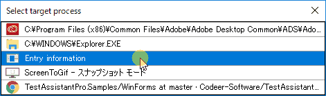
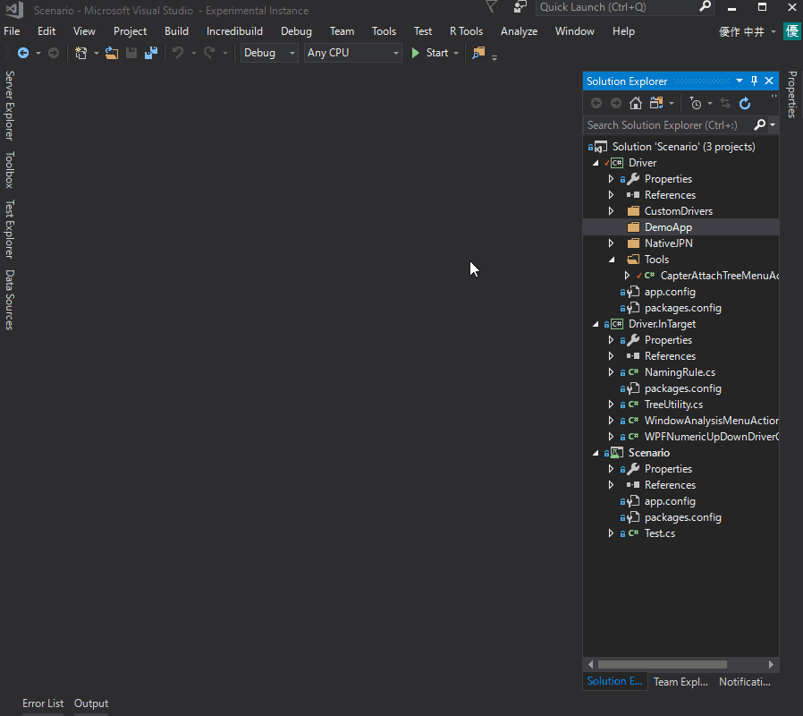
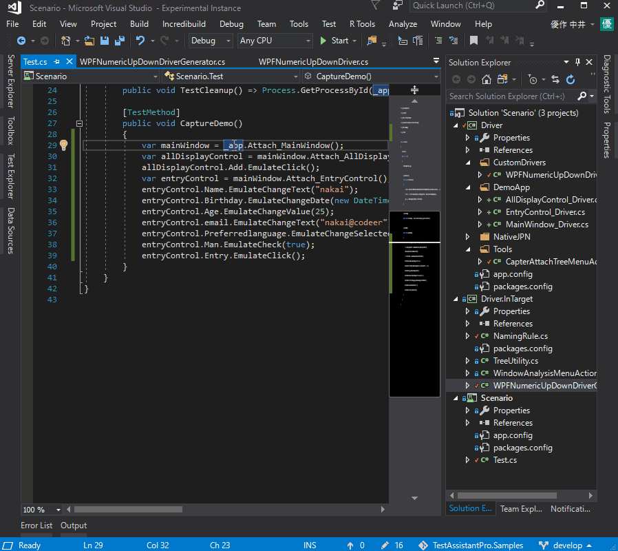

# WinForms Sample
It is a sample to experience Test.AssistantPro in the WPF application.

Preparation
-------------
##### 1. Open and Debug build DemoApp/DemoApp.sln
##### 2. Open and Debug build Scenario/Scenario.sln
##### 3. Start DemoApp from DemoApp/bin/Debug/DemoApp.exe

Experience
-------------
### 1. Analyze Window
Right-click on Folder (or Project) in Solution Explorer and execute "Analyze Window".

 

Select the application to be operated. Here, please select "Entry Infomation".

 
 
"Analyze Window" displays all the controls in the currently opened window.
You can check the values and properties of all controls.
If you want, you can change values and properties in "Analyze Window".

 

### 2. Create Driver
You can create a driver for the control you want to operate with "Create Driver" in "Analyze Window".
You can highlight the control corresponding to each line.

 

### 3. Capture
Right-click within CaptureTest function of Test.cs of Scenario project and execute "Capture".
The operation method is generated with the code using the driver.

 
 
### 4. Debug and Execute
Right-click within any function of Test.cs of Scenario project and execute "Execute".
You can execute the function immediately.

 
 
Also, if you execute "Debug" you can debug using VisualStudio's debugger.

 
 

