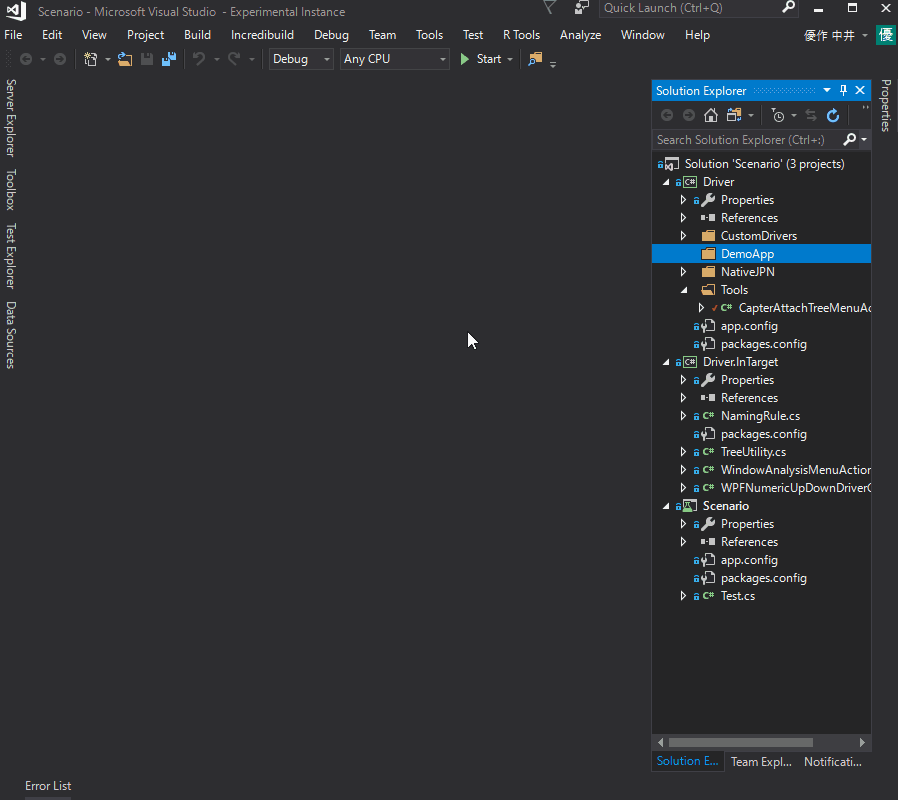

# WPF Sample
WPFアプリケーションでTest.AssistantProを体験するためのサンプルです。

準備
-------------
##### 1. DemoApp/DemoApp.sln を開き Debug でビルドしておきます。
##### 2. Scenario/Scenario.sln を開き Debug でビルドしておきます。
##### 3. DemoApp(DemoApp/bin/Debug/DemoApp.exe) を起動しておきます。

体験
-------------
### 1. Analyze Window
ソリューションエクスプローラでフォルダ（またはプロジェクト）を右クリックして"Analyze Window"を実行します。

 

操作するアプリケーションを選択してください。今回は"Entry Infomation"を選択してください。

 
 
"Analyze Window"は、現在開いているウィンドウ内のすべてのコントロールを表示します。
すべてのコントロールの値とプロパティを確認することができます。
必要に応じて、"Analyze Window"で値とプロパティを変更できます。

 

### 2. Create Driver
"Analyze Window"の"Create Driver"で操作したいコントロール用のドライバを作成できます。
各行に対応するコントロールをハイライトすることができます。

 

### 3. Capture
ScenarioプロジェクトのTest.csのCaptureTest関数内を右クリックして"Capture"を実行します。
操作メソッドはドライバを使用したコードで生成されます。

 
 
### 4. Debug と Execute
ScenarioプロジェクトのTest.csの任意の関数内を右クリックし、"Execute"を実行します。
すぐに機能を実行することができます。

 
 
また、「デバッグ」を実行すると、VisualStudioのデバッガを使用してデバッグできます。

 

### 5. カスタムコントロール
CustomControlドライバを作成する方法は3つあります。

最初の方法は、"Analyze Window" の "Create Driver" で作成することです。
作成コストは最も低いですが、保守性は悪いです。


2番目の方法は "UserControlDriver"としてそれを作成することです。
最初の方法と比較して1つの手順が追加されましたが、保守性は改善されます。


3つ目の方法は、そのコントロール用のドライバを自分で作成することです。
1番目と2番目に比べて、作成コストは高くなりますが、最も保守性が高く、希望する操作を確実に実行できる、高品質のドライバを作成できます。

*Source code WPFNumericUpDown.cs*
```csharp
namespace Driver.CustomDrivers
{
    [ControlDriver(TypeFullName = "DemoApp.Views.NumericUpDownControl")]
	public class WPFNumericUpDownDriver : WPFControlBase<NumericUpDownControl>
	{
		public WPFNumericUpDownDriver(AppVar src) : base(src) { }

		public int Value => Getter<int>("Value");

		public void EmulateChangeValue(int value)
		{
			var textBox = this.Dynamic().ValueTextBox;
			if (textBox != null)
			{
				textBox.Focus();
				textBox.Text = value.ToString();
			}
		}
	}
}
```

*Source code WPFNumericUpDownGenerator.cs*
```csharp
namespace Driver.InTarget
{
	[CaptureCodeGenerator("Driver.CustomDrivers.WPFNumericUpDownDriver")]
	public class WPFNumericUpDownDriverGenerator : CaptureCodeGeneratorBase
	{
		NumericUpDownControl _control;
		protected override void Attach()
		{
			_control = (NumericUpDownControl)ControlObject;
			_control.ValueChanged += ValueChanged;
		}

		protected override void Detach()
		{
			_control.ValueChanged -= ValueChanged;
		}

		void ValueChanged(object sender, EventArgs e)
		{
			if (_control.ValueTextBox.IsFocused || _control.UpButton.IsFocused || _control.DownButton.IsFocused)
				AddSentence(new TokenName(), ".EmulateChangeValue(" + _control.Value, new TokenAsync(CommaType.Before), ");");
		}

		public override void Optimize(List<Sentence> code)
		{
			bool findChangeText = false;
			for (int i = code.Count - 1; 0 <= i; i--)
			{
				if (IsDuplicatedFunction(code[i], "EmulateChangeValue"))
				{
					if (findChangeText)
					{
						code.RemoveAt(i);
					}
					findChangeText = true;
				}
				else
				{
					findChangeText = false;
				}
			}
		}

		private bool IsDuplicatedFunction(Sentence sentence, string function)
		{
			if (!ReferenceEquals(this, sentence.Owner))
			{
				return false;
			}
			if (sentence.Tokens.Length <= 2)
			{
				return false;
			}
			if (!(sentence.Tokens[0] is TokenName) ||
				(sentence.Tokens[1] == null))
			{
				return false;
			}
			return sentence.Tokens[1].ToString().IndexOf("." + function) == 0;
		}
	}
}
```
 
### 6.カスタマイズ
Windowsアプリケーションにはさまざまな機能があります。
統一的な方法で一括で処理した場合、効率的にコードを生成することは非常に困難です。
したがって、TestAssistantProは各プロジェクトに応じていくつかのカスタマイズ機能を提供します。
カスタマイズをうまく使用すれば、各プロジェクトにジャストフィットする非常に効率的なコード生成を実現できます。

#### 6.1. ドライバを生成するときに命名をカスタマイズする
ドライバを生成するときに各プロパティに使用される名前をカスタマイズできます。
これまでに作成された名前は、すでにカスタマイズされているので良い名前です。
命名規則は多くの場合プロジェクトによって異なるので、これはカスタマイズの形で提供されます。
WPFでは、多くの場合、このサンプルを各プロジェクトの規則に拡張することをお勧めします。
このサンプルでは、​​ContentControlはそのコンテンツの文字を使用します。
TextBox、ComboBox、Calendarも近くのTextBlock文字を使用します。
他のコントロールでは、デフォルトの命名規則を使います。
string.Emptyが返されると、デフォルトの命名規則が適用されます。

*良い命名規則で生成されたドライバのコード*
```csharp
[UserControlDriver(TypeFullName = "DemoApp.Views.EntryControl")]
public class EntryControl_Driver
{
    public WPFUserControl Core { get; }
    public WPFTextBox Name => new WPFTextBox(Core.Dynamic()._textBoxName);
    public WPFTextBox email => new WPFTextBox(Core.LogicalTree().ByBinding("Mail.Value").Single());
    public WPFComboBox Preferredlanguage => new WPFComboBox(Core.LogicalTree().ByBinding("Language.Value").Single());
    public WPFToggleButton Man => new WPFToggleButton(Core.LogicalTree().ByType<ContentControl>().ByContentText("Man").Single());
    public WPFToggleButton Woman => new WPFToggleButton(Core.LogicalTree().ByType<ContentControl>().ByContentText("Woman").Single());
    public WPFCalendar Birthday => new WPFCalendar(Core.LogicalTree().ByBinding("BirthDay.Value").Single());
    public WPFNumericUpDownDriver Age => new WPFNumericUpDownDriver(Core.LogicalTree().ByBinding("Age.Value").Single());
    public WPFButtonBase Entry => new WPFButtonBase(Core.LogicalTree().ByType<ContentControl>().ByContentText("Entry").Single());
    public WPFButtonBase Cancel => new WPFButtonBase(Core.LogicalTree().ByType<ContentControl>().ByContentText("Cancel").Single());

    public EntryControl_Driver(AppVar core)
    {
        Core = new WPFUserControl(core);
    }
}
``` 

*NamingRule.cs*
```csharp
public class NamingRule : IDriverElementNameGenerator
{
    CSharpCodeProvider _provider = new CSharpCodeProvider();

    public int Priority => 1;

    public string GenerateName(object target)
    {
        var name = GenerateNameCore(target);
        return _provider.IsValidIdentifier(name) ? name : string.Empty;
    }

    string GenerateNameCore(object target)
    { 
        if (target is ContentControl content)
        {
            if (content.Content is string) return content.Content.ToString().Replace(" ", "");
        }

        //Get name from nearby TextBlock.
        if (target is TextBox || target is ComboBox || target is Calendar || target is NumericUpDownControl)
        {
            var targetCtrl = target as Control;
            var targetPos = targetCtrl.PointToScreen(new Point());
            var root = targetCtrl.GetLogicalTreeAncestor().Where(e => e is UserControl || e is Window || e is Page).FirstOrDefault();

            //Search for the closest TextBlock on the left.
            Func<FrameworkElement, Point, bool> isSameLine = (ctrl, pos) =>
            {
                if (pos.Y < targetPos.Y - 5) return false;
                if (targetPos.Y + targetCtrl.ActualHeight < pos.Y) return false;
                return true;
            };
            var nearTextBlock = root.GetLogicalTreDescendants().OfType<FrameworkElement>().Select(e => new { ctrl = e, pos = e.PointToScreen(new Point()) }).
                Where(e => isSameLine(e.ctrl, e.pos) && e.pos.X < targetPos.X).
                OrderBy(e => e.pos.X).Select(e => e.ctrl).LastOrDefault() as TextBlock;

            //If it is not found, search for the closest TextBlock on the upper side.
            if (nearTextBlock == null)
            {
                Func<FrameworkElement, Point, bool> isSameCol = (ctrl, pos) =>
                {
                    if (pos.X < targetPos.X - 5) return false;
                    if (targetPos.X + targetCtrl.ActualWidth < pos.X) return false;
                    return true;
                };

                nearTextBlock = root.GetLogicalTreDescendants().OfType<FrameworkElement>().Select(e => new { ctrl = e, pos = e.PointToScreen(new Point()) }).
                    Where(e => isSameCol(e.ctrl, e.pos) && e.pos.Y < targetPos.Y).
                    OrderBy(e => e.pos.Y).Select(e => e.ctrl).LastOrDefault() as TextBlock;
            }

            if (nearTextBlock != null)
            {
                return nearTextBlock.Text.Replace(" ", "");
            }
        }

        return string.Empty;
    }
}
``` 
 
#### 6.2. メニューのカスタマイズ
自動テスト作成に慣れてくると、各プロジェクトに頻繁に実装されているコードがあることに気付くかもしれません。
そのような場合は、そのコード生成を自動化できます。

##### 6.2.1 IWindowAnalysisMenuAction
IWindowAnalysisMenuActionを実装するクラスを準備します。
"Analyze Window"のツリーのコンテキストメニューから呼び出すことができます。

 

引数のtargetは選択されたオブジェクトを含みます。
処理は対象アプリケーションのプロセス内で実行されるため、通常の.NETコードを記述することでカスタマイズ機能を実装できます。
ターゲットの種類を見て、それに従ってDictionaryのメニュー処理を返します。
キーはメニューに表示される文字列、値は操作のデリゲートです。
出力を[出力]タブに表示し、そこからコピーすることもできます。
独立したソースコードとして作成することもできます。

*WindowAnalysisMenuAction.cs*
```csharp
public class WindowAnalysisMenuAction : IWindowAnalysisMenuAction
{
    public Dictionary<string, MenuAction> GetAction(object target, WindowAnalysisTreeInfo info)
    {
        var dic = new Dictionary<string, MenuAction>();
        
        var grid = target as DataGrid;
        if (grid != null)
        {
            dic["Create Grid Column Define to Output."] = () =>
            {
                AnalyzeWindow.Output.Show();

                AnalyzeWindow.Output.WriteLine("public class GridColumns");
                AnalyzeWindow.Output.WriteLine("{");
                int i = 0;
                foreach (var e in grid.Columns)
                {
                    AnalyzeWindow.Output.WriteLine("    const int " + e.Header.ToString().Replace(" ", "") + " = " + i++ + ";");
                }
                AnalyzeWindow.Output.WriteLine("}");
            };

            dic["Create Grid Column Define to Code View."] = () =>
            {
                var code = new StringBuilder();
                code.AppendLine("namespace " + DriverCreatorAdapter.SelectedNamespace);
                code.AppendLine("{");
                code.AppendLine("    public class GridColumns");
                code.AppendLine("    {");
                int i = 0;
                foreach (var e in grid.Columns)
                {
                    code.AppendLine("        const int " + e.Header.ToString().Replace(" ", "") + " = " + i++ + ";");
                }
                code.AppendLine("    }");
                code.AppendLine("}");
                DriverCreatorAdapter.AddCode("GridColumns.cs", code.ToString(), target);
            };
        }
        return dic;
    }
}
```

*Show analyzed info with Output.*
 

*Show analyzed info with CodeViewer.*
 

##### 6.2.2 ICapterAttachTreeMenuAction
ICapterAttachTreeMenuActionを実装するクラスを用意した場合
キャプチャしているAttach Treeのコンテキストメニューから呼び出すことができます。

 

引数のaccessPathには、キャプチャ時の変数名が含まれています。
drierはドライバーに含まれています。
IWindowAnalysisMenuActionと同様に、ターゲットの種類を調べ、それに従ってDictionary操作のメニュー操作を返します。
キーはメニューに表示される文字列、値は操作のデリゲートです。
CaptureAdaptor.AddCodeで出力すると、
コードがキャプチャコードビューに出力されます。
サンプルでは、その時点で正しい制御状態を出力するAssertコードが出力されます。

*Source code CapterAttachTreeMenuAction.cs*
```csharp
public class CapterAttachTreeMenuAction : ICapterAttachTreeMenuAction
{
    public Dictionary<string, MenuAction> GetAction(string accessPath, object driver)
    {
        var dic = new Dictionary<string, MenuAction>();

        dic["Assert"] = () =>
        {
            foreach (var e in driver.GetType().GetProperties())
            {
                var obj = e.GetValue(driver);
                if (obj == null) continue;

                if (obj is WPFTextBox textBox)
                {
                    CaptureAdaptor.AddCode(accessPath + "." + e.Name + ".Text.Is(\"" + textBox.Text + "\");");
                }
                if (obj is WPFComboBox combo)
                {
                    CaptureAdaptor.AddCode(accessPath + "." + e.Name + ".SelectedIndex.Is(" + combo.SelectedIndex + ");");
                }
                if (obj is WPFToggleButton toggle)
                {
                    var ret = toggle.IsChecked == null ? "IsNull()" :
                                toggle.IsChecked == true ? "Value.IsTrue()" : "Value.IsFalse()";
                    CaptureAdaptor.AddCode(accessPath + "." + e.Name + ".IsChecked." + ret + ";");
                }
                if (obj is WPFCalendar calender)
                {
                    var ret = calender.SelectedDate == null ? "IsNull()" :
                    "Is(new DateTime(" + calender.SelectedDate.Value.Year + ", " +  calender.SelectedDate.Value.Month + ", " + calender.SelectedDate.Value.Day + "))";
                    CaptureAdaptor.AddCode(accessPath + "." + e.Name + ".SelectedDate." + ret + ";");
                }
                if (obj is WPFNumericUpDownDriver numericUpDown)
                {
                    CaptureAdaptor.AddCode(accessPath + "." + e.Name + ".Value.Is(" + numericUpDown.Value + ");");
                }
            }
        };

        return dic;
    }
}
```

### 7. デバッグ
TestAssistantProは、ドライバとカスタマイズコードを使用してコード生成を支援します。
コードによってはうまく動作しないかもしれません。
そのような場合に備えて、デバッグ機能があります。

#### 7.1 ログ
予想される動作が行われない場合は、ログを確認してください。
場合によっては、例外が表示されることがあります。
あなたは手製のログ出力を行うこともできます。
たとえば、ICapterAttachTreeMenuActionを実装するクラスの作成状態を知りたい場合は、Loggerクラスを使用してログを出力できます。
これは、IWindowAnalysisMenuActionを実装するためにも使用できます。または、ドライバに含めることもできます。

```csharp
public class WindowAnalysisMenuAction: IWindowAnalysisMenuAction
{
    public Dictionary <string, MenuAction> GetAction (object target, WindowAnalysisTreeInfo info)
    {
        Logger.WriteLine("Execute GetAction.");
        ...
    }
}
```

#### 7.2 デバッグ
分析中に、Captureでドライバをデバッグしたりコードをカスタマイズしたりする場合は、各修飾キーを押して各機能を実行します。

Shift キー機能
* ターゲットプロセスをデバッグします。
* IWindowAnalysisMenuAction、IDriverElementNameGeneratorなどを使用して、カスタマイズしたコードをデバッグできます。

Ctrl キー機能
* ツール側のプロセスをデバッグします。
* あなたはDriverかIWindow AnalysisMenuActionでカスタマイズされたコードをデバッグすることができます。

これらのキー修飾子をExecuteと一緒に使用することもできます。
実行中にターゲットプロセス内で実行されているユーザーコード（たとえば注入されたモックコードなど）をデバッグすることもできます。

### 8. Win32コントロール
Win32コントロールのドライバを生成することは可能です。
ただし、MessageBoxやファイル・フォルダ関連のウィンドウは特別です。
生成されたドライバよりも優れたドライバが必要です。
私たちはWin32コントロール用の品質の高いドライバを用意しましたので、それを使ってください。

*Here is the Win32 drivers we prepared.*
 
 
*Capture and operation for OpenFileDialog.*
 
