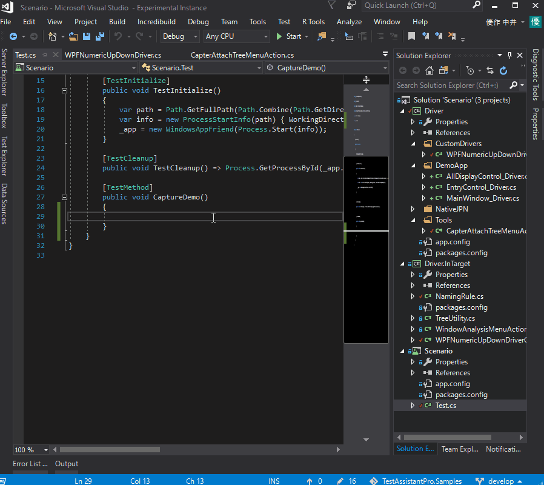

# WPF Sample
WPF?????????Test.AssistantPro???????????????

????
-------------
##### 1. DemoApp/DemoApp.sln ????Debug??????????
##### 2. Scenario/Scenario.sln ????Debug??????????
##### 3. DemoApp(DemoApp/bin/Debug/DemoApp.exe) ???????

??
-------------
### 1. Analyze Window
?????????????????????????????????????????"Analyze Window" ???????

 

????????????????????????"Entry Infomation" ??????????

 
 
"Analyze Window" ??????????????????????????????????
???????????????????????????????
???????"Analyze Window" ????????????????????????

 

### 2. Create Driver
"Analyze Window" ?? "Create Driver" ???????????????????????????????????????
?????????????????????????????????????????????????????????????????????

 

### 3. Capture
??????????? Test.cs ???CaptureTest????????????"Capture" ???????
???????????????????????????????

 
 
### 4. Debug ? Execute
??????????? Test.cs ??????????????"Execute" ???????
????????????????????

 
 
 ???"Debug" ???????VisualStudio ????????????????????????

 

### 5. ??????????
???????????????????????3??????????

1????"Analyze Window" ?? "Create Driver" ???????????????
????????????????????????????????????


2????"UserControlDriver" ????????????
1????????????????????????????????????????????


3??????????????????????
1?2???????????????????????????????????????????????????????????????

*Source code WPFNumericUpDown.cs*
```csharp
namespace Driver.CustomDrivers
{
    [ControlDriver(TypeFullName = "DemoApp.Views.NumericUpDownControl")]
	public class WPFNumericUpDownDriver : WPFControlBase<NumericUpDownControl>
	{
		public WPFNumericUpDownDriver(AppVar src) : base(src) { }

		public int Value => Getter<int>("Value");

		public void EmulateChangeValue(int value)
		{
			var textBox = this.Dynamic().ValueTextBox;
			if (textBox != null)
			{
				textBox.Focus();
				textBox.Text = value.ToString();
			}
		}
	}
}
```

*Source code WPFNumericUpDownGenerator.cs*
```csharp
namespace Driver.InTarget
{
	[CaptureCodeGenerator("Driver.CustomDrivers.WPFNumericUpDownDriver")]
	public class WPFNumericUpDownDriverGenerator : CaptureCodeGeneratorBase
	{
		NumericUpDownControl _control;
		protected override void Attach()
		{
			_control = (NumericUpDownControl)ControlObject;
			_control.ValueChanged += ValueChanged;
		}

		protected override void Detach()
		{
			_control.ValueChanged -= ValueChanged;
		}

		void ValueChanged(object sender, EventArgs e)
		{
			if (_control.ValueTextBox.IsFocused || _control.UpButton.IsFocused || _control.DownButton.IsFocused)
				AddSentence(new TokenName(), ".EmulateChangeValue(" + _control.Value, new TokenAsync(CommaType.Before), ");");
		}

		public override void Optimize(List<Sentence> code)
		{
			bool findChangeText = false;
			for (int i = code.Count - 1; 0 <= i; i--)
			{
				if (IsDuplicatedFunction(code[i], "EmulateChangeValue"))
				{
					if (findChangeText)
					{
						code.RemoveAt(i);
					}
					findChangeText = true;
				}
				else
				{
					findChangeText = false;
				}
			}
		}

		private bool IsDuplicatedFunction(Sentence sentence, string function)
		{
			if (!ReferenceEquals(this, sentence.Owner))
			{
				return false;
			}
			if (sentence.Tokens.Length <= 2)
			{
				return false;
			}
			if (!(sentence.Tokens[0] is TokenName) ||
				(sentence.Tokens[1] == null))
			{
				return false;
			}
			return sentence.Tokens[1].ToString().IndexOf("." + function) == 0;
		}
	}
}
```
 
### 6. ??????
Windows ?????????????????????
?????????????????????????????????????
????TestAssistantPro ??????????????????????????????????
??????????????????????????????????????????????????????

#### 6.1. ???????????????????
???????????????????????????????????
?????????????????????????????????????
?????????????????????????????????????????????
WPF?????????????????????????????????????????
???????????ContentControl??????????????????
TextBox?ComboBox?Calendar????TextBlock?????????
???????????????????????????
string.Empty?????????????????????????

*Code of the driver generated in a nice touch*
```csharp
[UserControlDriver(TypeFullName = "DemoApp.Views.EntryControl")]
public class EntryControl_Driver
{
    public WPFUserControl Core { get; }
    public WPFTextBox Name => new WPFTextBox(Core.Dynamic()._textBoxName);
    public WPFTextBox email => new WPFTextBox(Core.LogicalTree().ByBinding("Mail.Value").Single());
    public WPFComboBox Preferredlanguage => new WPFComboBox(Core.LogicalTree().ByBinding("Language.Value").Single());
    public WPFToggleButton Man => new WPFToggleButton(Core.LogicalTree().ByType<ContentControl>().ByContentText("Man").Single());
    public WPFToggleButton Woman => new WPFToggleButton(Core.LogicalTree().ByType<ContentControl>().ByContentText("Woman").Single());
    public WPFCalendar Birthday => new WPFCalendar(Core.LogicalTree().ByBinding("BirthDay.Value").Single());
    public WPFNumericUpDownDriver Age => new WPFNumericUpDownDriver(Core.LogicalTree().ByBinding("Age.Value").Single());
    public WPFButtonBase Entry => new WPFButtonBase(Core.LogicalTree().ByType<ContentControl>().ByContentText("Entry").Single());
    public WPFButtonBase Cancel => new WPFButtonBase(Core.LogicalTree().ByType<ContentControl>().ByContentText("Cancel").Single());

    public EntryControl_Driver(AppVar core)
    {
        Core = new WPFUserControl(core);
    }
}
``` 

*NamingRule.cs*
```csharp
public class NamingRule : IDriverElementNameGenerator
{
    CSharpCodeProvider _provider = new CSharpCodeProvider();

    public int Priority => 1;

    public string GenerateName(object target)
    {
        var name = GenerateNameCore(target);
        return _provider.IsValidIdentifier(name) ? name : string.Empty;
    }

    string GenerateNameCore(object target)
    { 
        if (target is ContentControl content)
        {
            if (content.Content is string) return content.Content.ToString().Replace(" ", "");
        }

        //Get name from nearby TextBlock.
        if (target is TextBox || target is ComboBox || target is Calendar || target is NumericUpDownControl)
        {
            var targetCtrl = target as Control;
            var targetPos = targetCtrl.PointToScreen(new Point());
            var root = targetCtrl.GetLogicalTreeAncestor().Where(e => e is UserControl || e is Window || e is Page).FirstOrDefault();

            //Search for the closest TextBlock on the left.
            Func<FrameworkElement, Point, bool> isSameLine = (ctrl, pos) =>
            {
                if (pos.Y < targetPos.Y - 5) return false;
                if (targetPos.Y + targetCtrl.ActualHeight < pos.Y) return false;
                return true;
            };
            var nearTextBlock = root.GetLogicalTreDescendants().OfType<FrameworkElement>().Select(e => new { ctrl = e, pos = e.PointToScreen(new Point()) }).
                Where(e => isSameLine(e.ctrl, e.pos) && e.pos.X < targetPos.X).
                OrderBy(e => e.pos.X).Select(e => e.ctrl).LastOrDefault() as TextBlock;

            //If it is not found, search for the closest TextBlock on the upper side.
            if (nearTextBlock == null)
            {
                Func<FrameworkElement, Point, bool> isSameCol = (ctrl, pos) =>
                {
                    if (pos.X < targetPos.X - 5) return false;
                    if (targetPos.X + targetCtrl.ActualWidth < pos.X) return false;
                    return true;
                };

                nearTextBlock = root.GetLogicalTreDescendants().OfType<FrameworkElement>().Select(e => new { ctrl = e, pos = e.PointToScreen(new Point()) }).
                    Where(e => isSameCol(e.ctrl, e.pos) && e.pos.Y < targetPos.Y).
                    OrderBy(e => e.pos.Y).Select(e => e.ctrl).LastOrDefault() as TextBlock;
            }

            if (nearTextBlock != null)
            {
                return nearTextBlock.Text.Replace(" ", "");
            }
        }

        return string.Empty;
    }
}
``` 
 
#### 6.2. ???????????
?????????????????????????????????????????????????????
?????????????????????????

##### 6.2.1 IWindowAnalysisMenuAction
IWindowAnalysisMenuAction ???????????????
"Analyze Window" ?????????????????????????????

 

??????????????????????????
???????????????????????????????.NET???????????????????????????
?????????????????? Dictionary ?????????????
??????????????????????????????
???[??]????????????????????????
?????????????????????????

*WindowAnalysisMenuAction.cs*
```csharp
public class WindowAnalysisMenuAction : IWindowAnalysisMenuAction
{
    public Dictionary<string, MenuAction> GetAction(object target, WindowAnalysisTreeInfo info)
    {
        var dic = new Dictionary<string, MenuAction>();
        
        var grid = target as DataGrid;
        if (grid != null)
        {
            dic["Create Grid Column Define to Output."] = () =>
            {
                AnalyzeWindow.Output.Show();

                AnalyzeWindow.Output.WriteLine("public class GridColumns");
                AnalyzeWindow.Output.WriteLine("{");
                int i = 0;
                foreach (var e in grid.Columns)
                {
                    AnalyzeWindow.Output.WriteLine("    const int " + e.Header.ToString().Replace(" ", "") + " = " + i++ + ";");
                }
                AnalyzeWindow.Output.WriteLine("}");
            };

            dic["Create Grid Column Define to Code View."] = () =>
            {
                var code = new StringBuilder();
                code.AppendLine("namespace " + DriverCreatorAdapter.SelectedNamespace);
                code.AppendLine("{");
                code.AppendLine("    public class GridColumns");
                code.AppendLine("    {");
                int i = 0;
                foreach (var e in grid.Columns)
                {
                    code.AppendLine("        const int " + e.Header.ToString().Replace(" ", "") + " = " + i++ + ";");
                }
                code.AppendLine("    }");
                code.AppendLine("}");
                DriverCreatorAdapter.AddCode("GridColumns.cs", code.ToString(), target);
            };
        }
        return dic;
    }
}
```

*Show analyzed info with Output.*
 

*Show analyzed info with CodeViewer.*
 

##### 6.2.2 ICapterAttachTreeMenuAction
ICapterAttachTreeMenuAction ????????????????
????????? Attach Tree ?????????????????????????

 

??? accessPath ??????????????????????
driver ? Driver ???????????????
IWindowAnalysisMenuAction??????????????????????? Dictionary ???????????????
??????????????????????????????
CaptureAdaptor.AddCode ???????
???????????????????????
?????????????????????????? Assert ???????????

*Source code CapterAttachTreeMenuAction.cs*
```csharp
public class CapterAttachTreeMenuAction : ICapterAttachTreeMenuAction
{
    public Dictionary<string, MenuAction> GetAction(string accessPath, object driver)
    {
        var dic = new Dictionary<string, MenuAction>();

        dic["Assert"] = () =>
        {
            foreach (var e in driver.GetType().GetProperties())
            {
                var obj = e.GetValue(driver);
                if (obj == null) continue;

                if (obj is WPFTextBox textBox)
                {
                    CaptureAdaptor.AddCode(accessPath + "." + e.Name + ".Text.Is(\"" + textBox.Text + "\");");
                }
                if (obj is WPFComboBox combo)
                {
                    CaptureAdaptor.AddCode(accessPath + "." + e.Name + ".SelectedIndex.Is(" + combo.SelectedIndex + ");");
                }
                if (obj is WPFToggleButton toggle)
                {
                    var ret = toggle.IsChecked == null ? "IsNull()" :
                                toggle.IsChecked == true ? "Value.IsTrue()" : "Value.IsFalse()";
                    CaptureAdaptor.AddCode(accessPath + "." + e.Name + ".IsChecked." + ret + ";");
                }
                if (obj is WPFCalendar calender)
                {
                    var ret = calender.SelectedDate == null ? "IsNull()" :
                    "Is(new DateTime(" + calender.SelectedDate.Value.Year + ", " +  calender.SelectedDate.Value.Month + ", " + calender.SelectedDate.Value.Day + "))";
                    CaptureAdaptor.AddCode(accessPath + "." + e.Name + ".SelectedDate." + ret + ";");
                }
                if (obj is WPFNumericUpDownDriver numericUpDown)
                {
                    CaptureAdaptor.AddCode(accessPath + "." + e.Name + ".Value.Is(" + numericUpDown.Value + ");");
                }
            }
        };

        return dic;
    }
}
```

### 7. ????
TestAssistantPro?????????????????????????????????
????????????????????????????
????????????????????????

#### 7.1 ??
????????????????????????????
????????????????????????
?????????????????????
?????ICapterAttachTreeMenuAction?????????????????????????Logger??????????????????
????IWindowAnalysisMenuAction????????????????????????????????????

```csharp
public class WindowAnalysisMenuAction: IWindowAnalysisMenuAction
{
    public Dictionary <string, MenuAction> GetAction (object target, WindowAnalysisTreeInfo info)
    {
        Logger.WriteLine ("Execute GetAction.");
        ...
    }
}
```

#### 7.2 ??????
?????Capture ???????????????????????????????????????????????????

Shift ????
* ??????????????????
* ?????????????IWindowAnalysisMenuAction?IDriverElementNameGenerator ????????????????

Ctrl ????
* ??????????????????
* ???? Driver ? IWindowAnalysisMenuAction ????????????????????????????

?????????? Execute ????????????????
???????????????????????????????????????????????????????????????

### 8. Win32 control
Win32????????????????????????
????MessageBox ????????????????????????
?????????????????????????
????Win32??????????????????????????????????????

*Here is the Win32 drivers we prepared.*
 
 
*Capture and operation for OpenFileDialog.*
 
