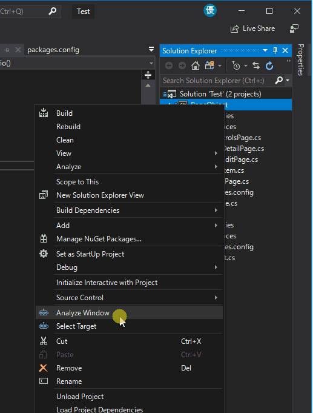
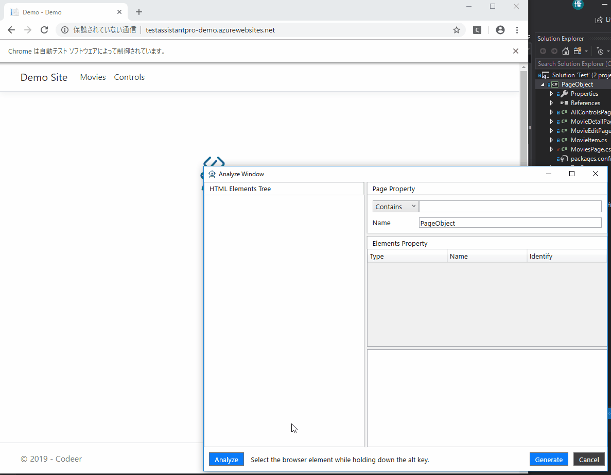
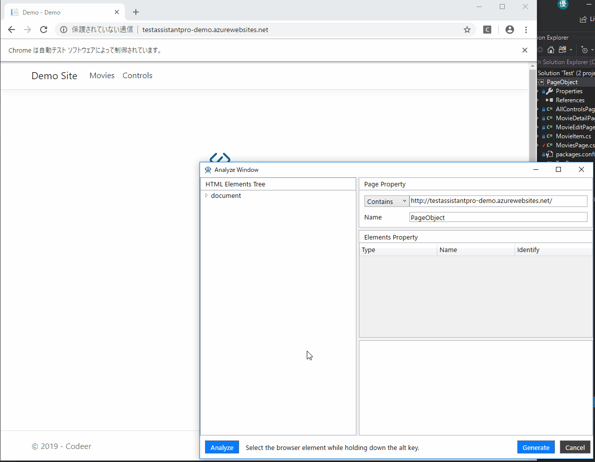
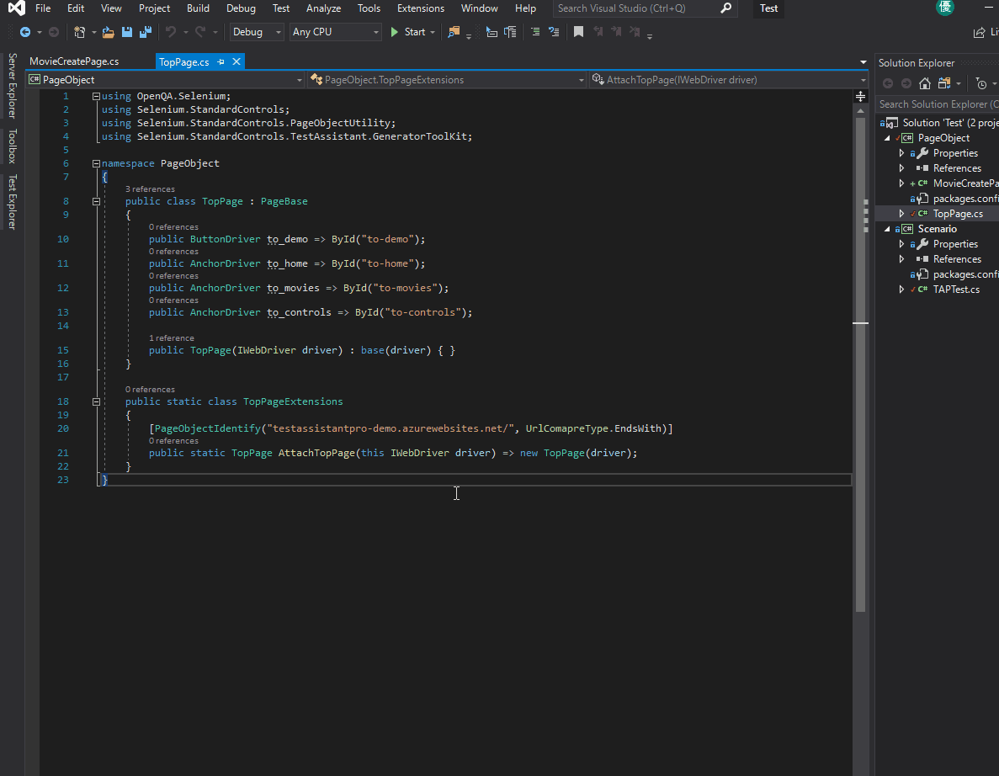
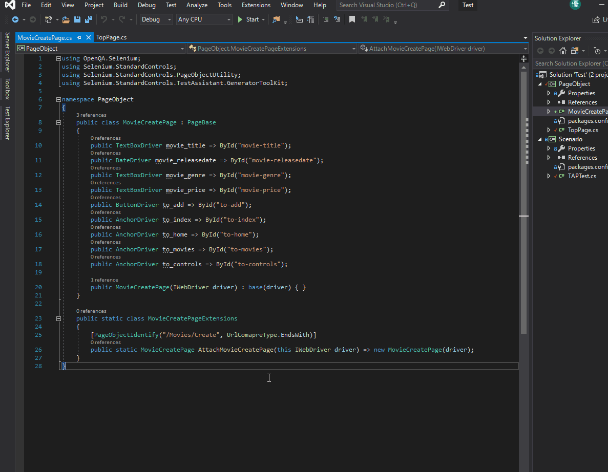
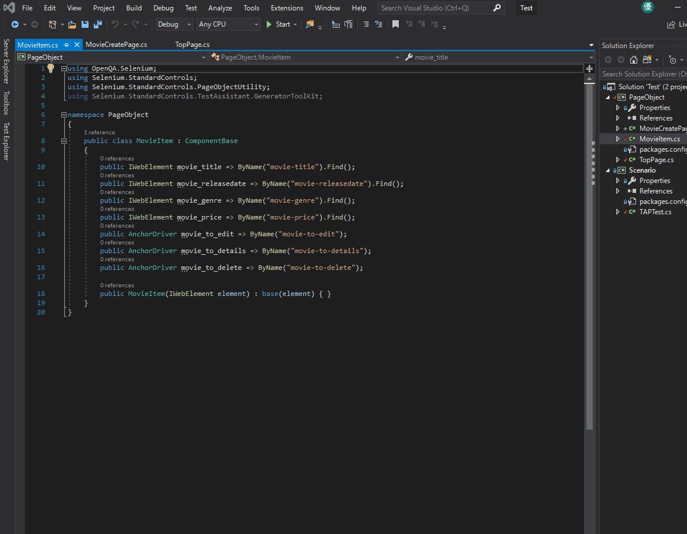
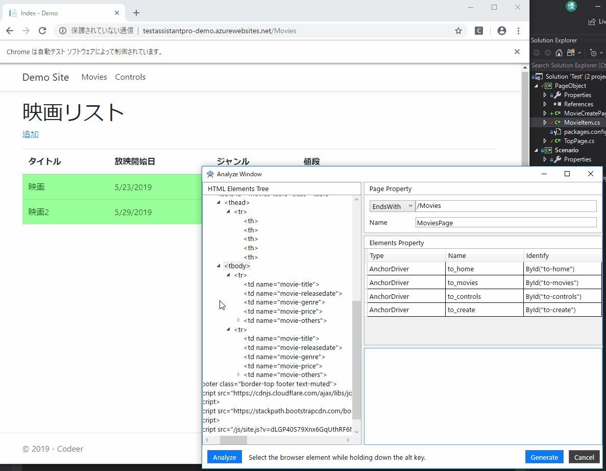
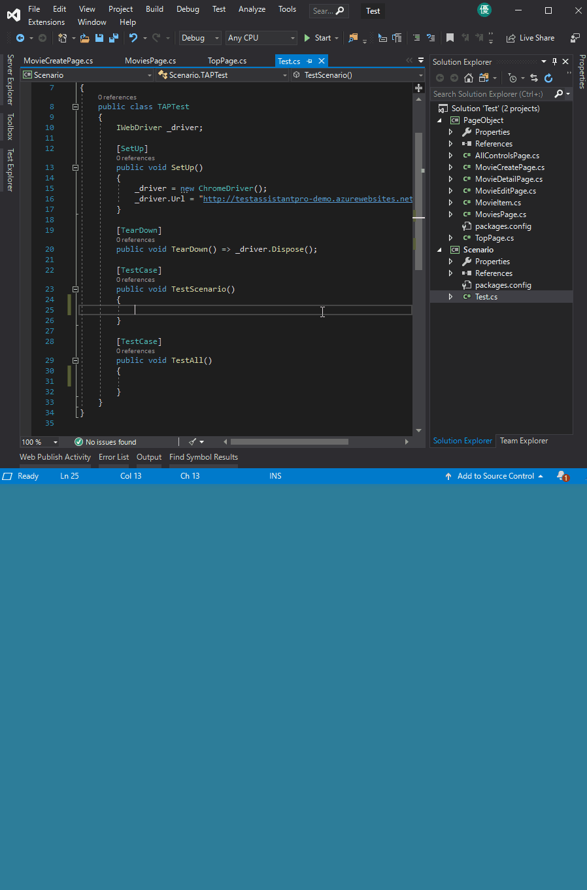
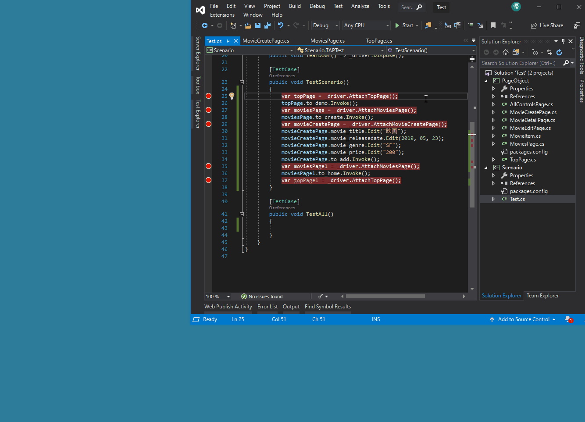

# Web Sample
It is a sample to experience TestAssistantPro in a web page.

For Japanese: [日本語](https://github.com/Codeer-Software/TestAssistantPro.Samples/blob/master/Web/README_JP.md)

Preparation
--------------
#### 1. Open Test.sln and build it.

Experience
--------------
### 1. Analyze Window
Right click on the folder (or project) in Solution Explorer and execute "Analyze Window".

The "Select Target" window will be displayed. Select "Selenium".

"Analyze Window" can analyze the currently open page and display the structure in a tree.
First, open the page you want to operate and press the "Analyze" button.

Double-click an element in the tree to add it to the target list.

You can also add to the operation target list by the following procedure.

1. Hold down the Alt key.
2. Move the cursor to the target you want to operate on the browser
3. Release the Alt key
4. If the color of the object you want to operate has changed, double click

### 2. Create Driver
You can generate a driver by pressing the "Generate" button in the "Analyze Window".
Also, drivers can be created continuously.
You can set in advance the properties of the driver generated with "Page Property".

The first TextBox allows you to set the conditions for attaching the driver.

The second TextBox allows you to set the driver's name.

 
 Generated code

 

 
#### 2.1 Component Object
In the case of a parent element that has multiple consecutive elements as a child, you can use ItemsControlDriver <T> by creating a driver for the child element.
In this chapter, we will show you how to create a child component driver "Component Object".

1. First, select a series of elements and right click.
2. Next, select "Design Component Object".
3. Then the screen changes and it will become the creation screen of "Component Object".
4. Select the operation target of "Component Object" in the same way as when creating a normal driver.
5. Press the "Generate" button.

 
 Generated code

 
#### 2.2 ItemsControlDriver <T>
Then, use ItemsControlDriver <T> using "Component Object" created earlier.

1. Double-click the parent element of multiple consecutive elements.
2. Click the Type of Element added to the operation target list, and select ItemsControlDriver <PageObject.MovieItem>.
3. Press the "Generate" button.

 
 Generated code

 
### 3. Capture
Right-click inside the TestScenario function of TAPTest.cs in the Scenario project and execute "Capture".
Operation methods are generated in code using a driver.

 
### 4. Debug and Execute
Right-click in any function of Test.cs in the Scenario project and execute "Execute".
You can execute the function immediately.

 
You can also use "Debug" to debug using Visual Studio's debugger.

