# Web Sample
WebページでTestAssistantProを体験するためのサンプルです。

準備
-------------
##### 1. Test.sln を開き、ビルドしておきます。

体験
-------------
### 1. Analyze Window
ソリューションエクスプローラでフォルダ（またはプロジェクト）を右クリックして"Analyze Window"を実行します。

 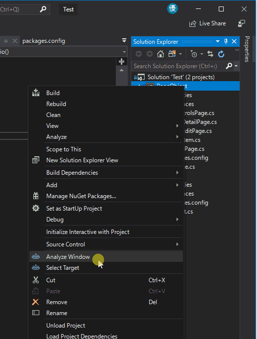

"Select Target"のウィンドウが表示されるので、"Selenium"を選択してください。

 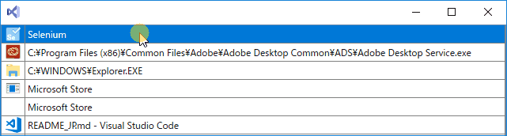
 
"Analyze Window"は、現在開いているページを解析し、構造をツリーで表示する事が出来ます。
まずは、操作したいページを開いて、"Analyze"ボタンを押してください。

 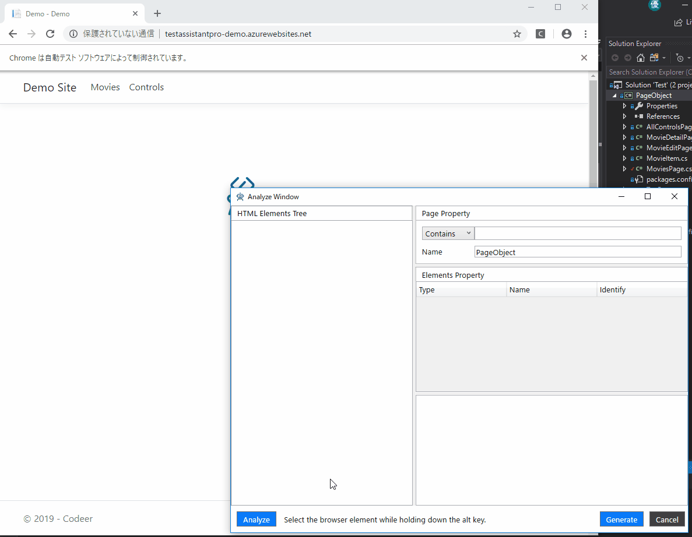

ツリー内の要素をダブルクリックすると、その要素を操作対象リストに追加します。

 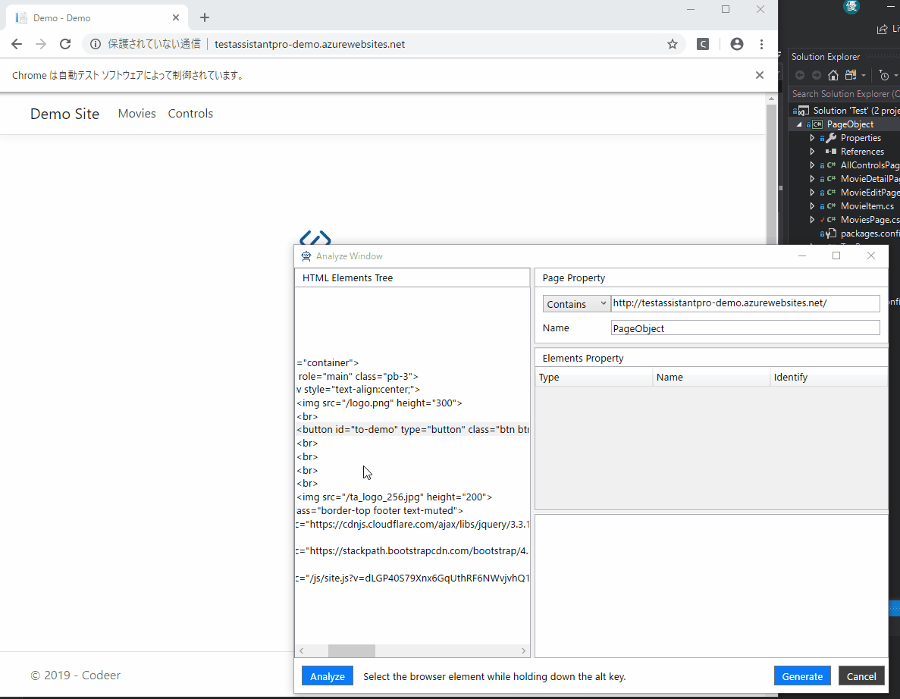

また、次の手順でも操作対象リストへの追加が可能です。

1. Altキーを押しっぱなしにする。
2. ブラウザ上で操作したい対象にカーソルを合わせる
3. Altキーを離す
4. 操作したい対象の色が変わっていれば、ダブルクリックする

 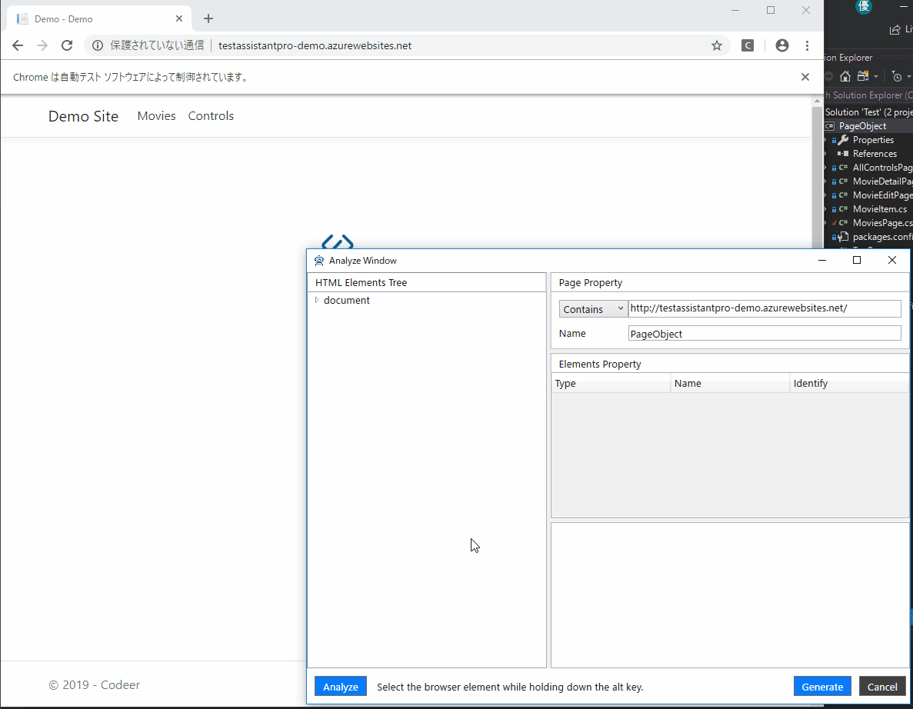

### 2. Create Driver
"Analyze Window"で"Generate"ボタンを押すと、ドライバを生成する事が出来ます。
また、ドライバは連続して作成する事も可能です。
"Page Property"で生成するドライバのプロパティを事前に設定出来ます。

1つ目のTextBoxで、ドライバのアタッチ時の条件を設定出来ます。

2つ目のTextBoxで、ドライバの名前を設定出来ます。

 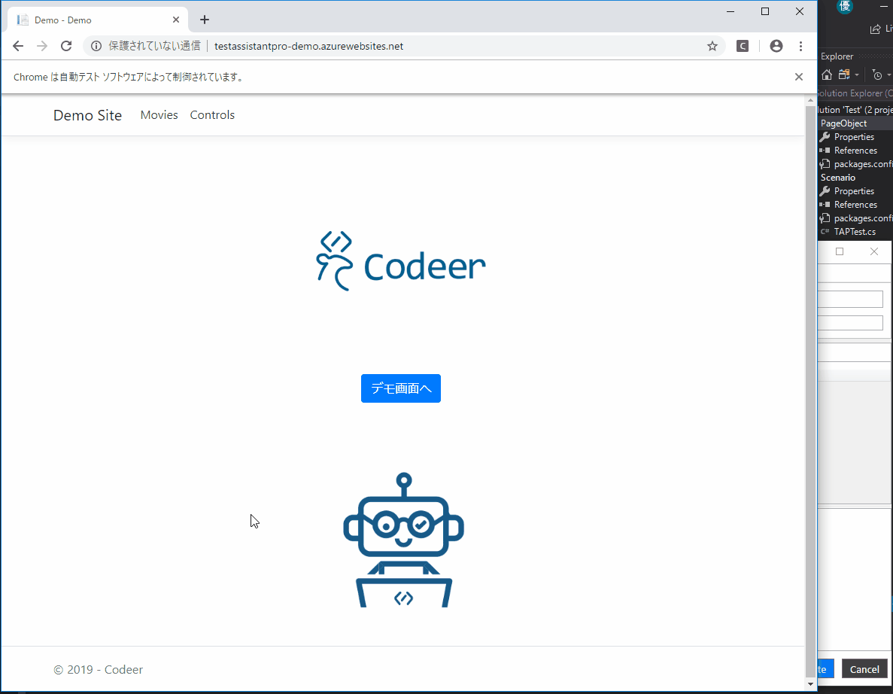
 
 生成されたコード

 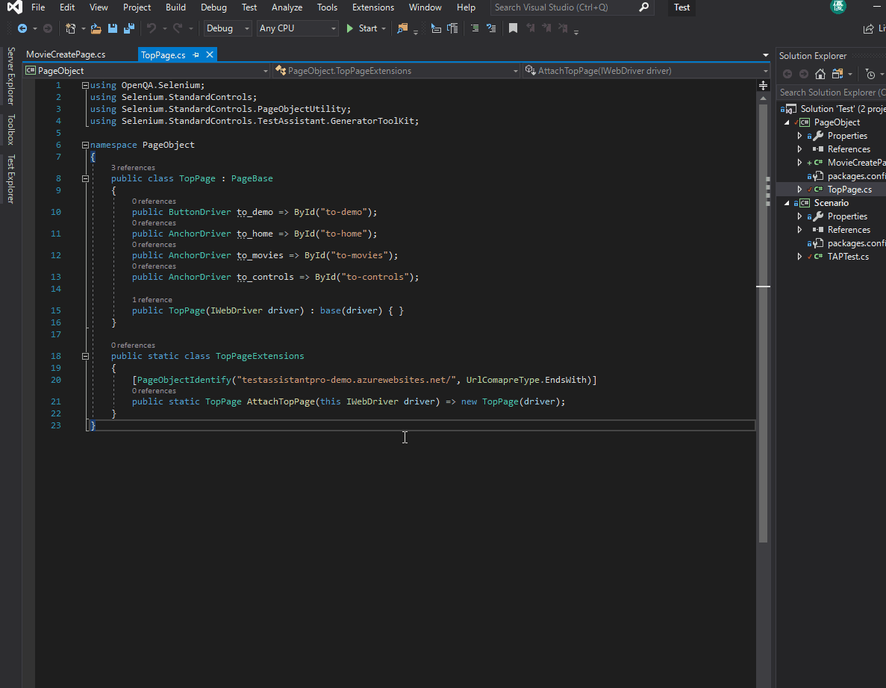
 
 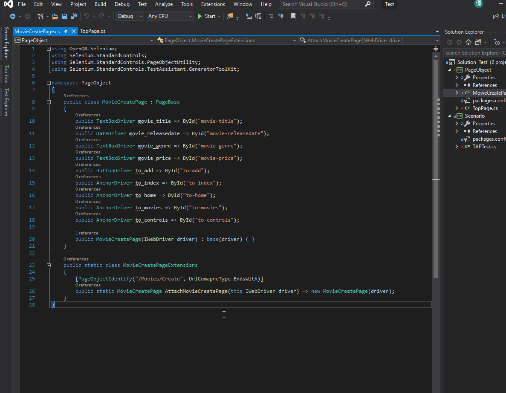
 
#### 2.1 Component Object
連続した複数の要素を子に持つ親要素の場合、子要素のドライバを作成する事で、ItemsControlDriver<T>を使用する事が出来ます。
この章では、子要素のドライバ"Component Object"の作り方を説明します。

1. まず、連続した複数の要素を選択し、右クリックします。
2. 次に、"Design Component Object"を選択します。
3. すると、画面が切り替わり、"Component Object"の作成画面になります。
4. 通常のドライバ作成時と同様に、"Component Object"の操作対象を選択していきます。
5. "Generate"ボタンを押します。

 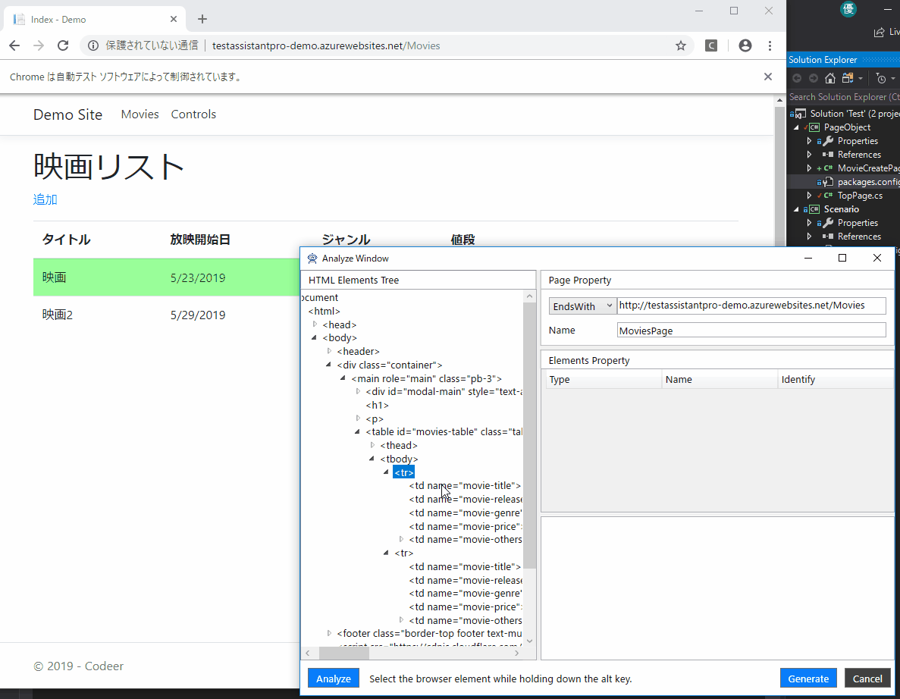
 
 生成されたコード

 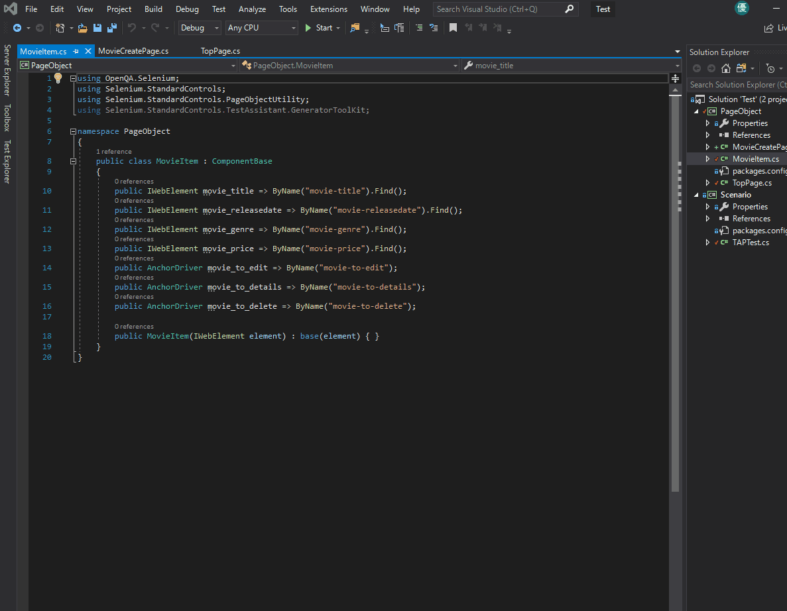
 
#### 2.2 ItemsControlDriver<T>
続いて、先ほど作成した"Component Object"を使用して、ItemsControlDriver<T>を使用します。

1. 連続した複数の要素の親要素をダブルクリックします。
2. 操作対象リストに追加されたElementのTypeをクリックし、ItemsControlDriver<PageObject.MovieItem>を選択します。
3. "Generate"ボタンを押します。

 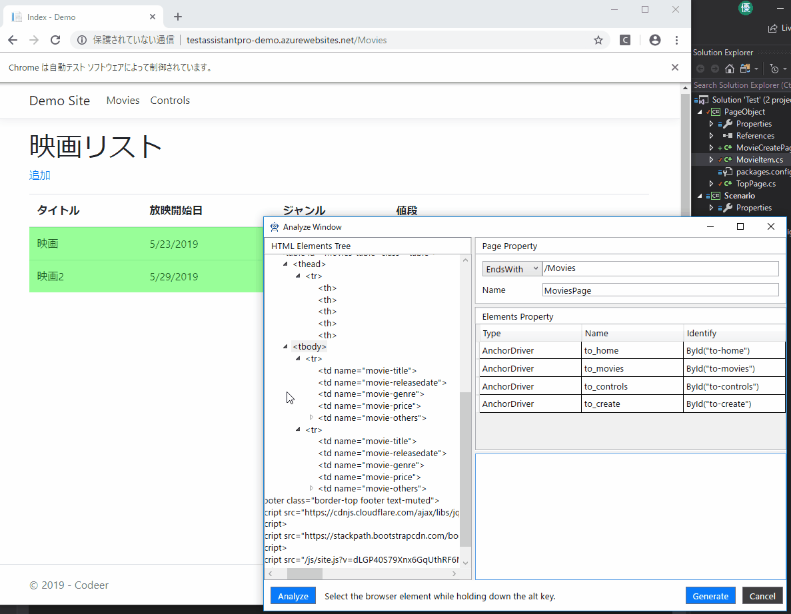
 
 生成されたコード

 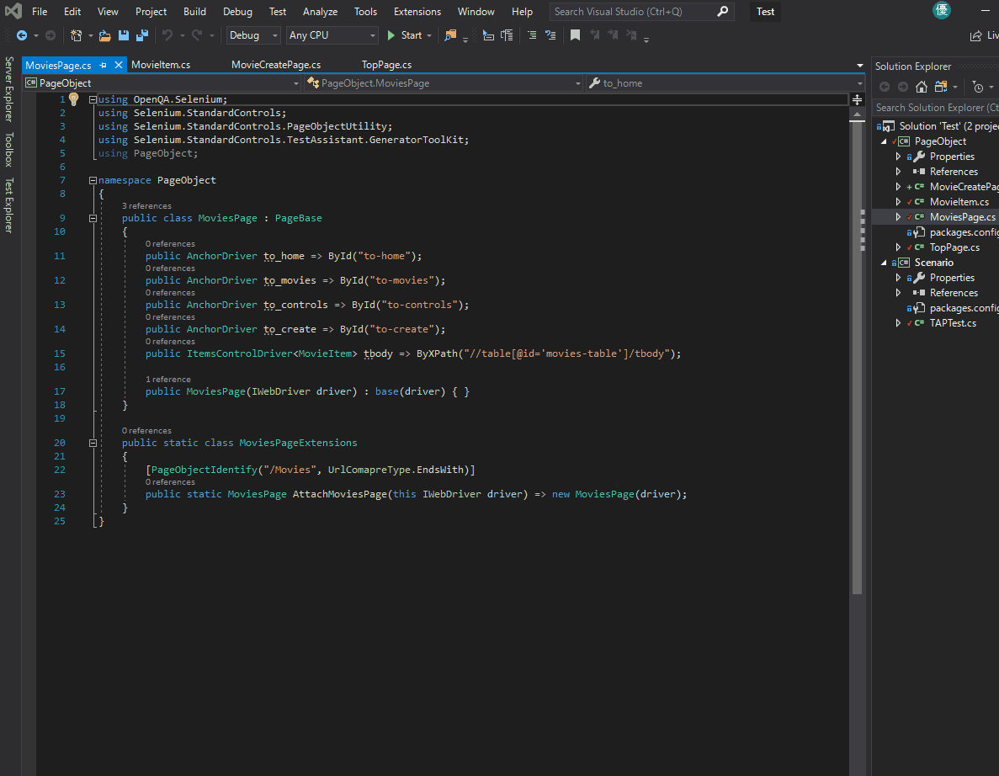
 
### 3. Capture
ScenarioプロジェクトのTAPTest.csのTestScenario関数内を右クリックして"Capture"を実行します。
操作メソッドはドライバを使用したコードで生成されます。

 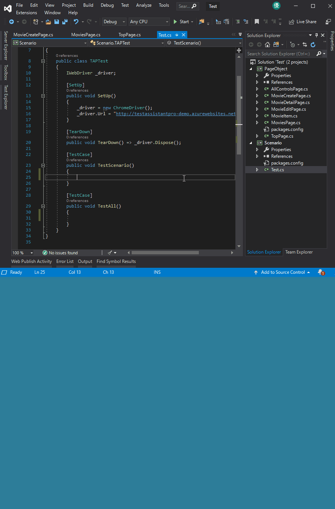
 
### 4. Debug と Execute
ScenarioプロジェクトのTest.csの任意の関数内を右クリックし、"Execute"を実行します。
すぐに機能を実行することができます。

 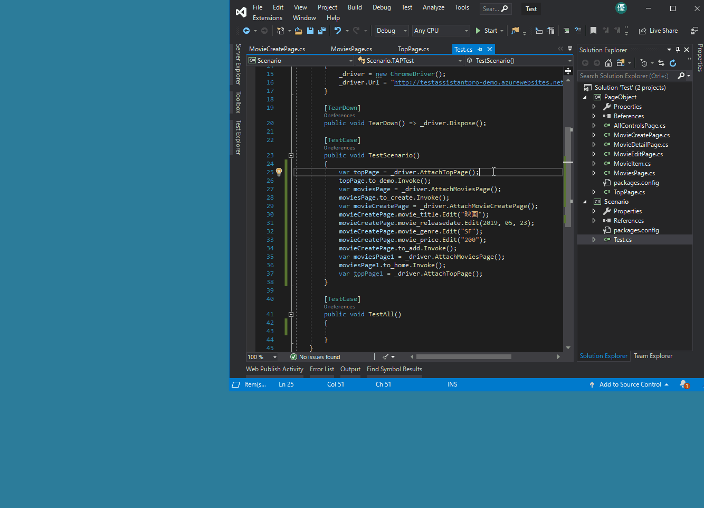
 
また、「デバッグ」を実行すると、VisualStudioのデバッガを使用してデバッグできます。

 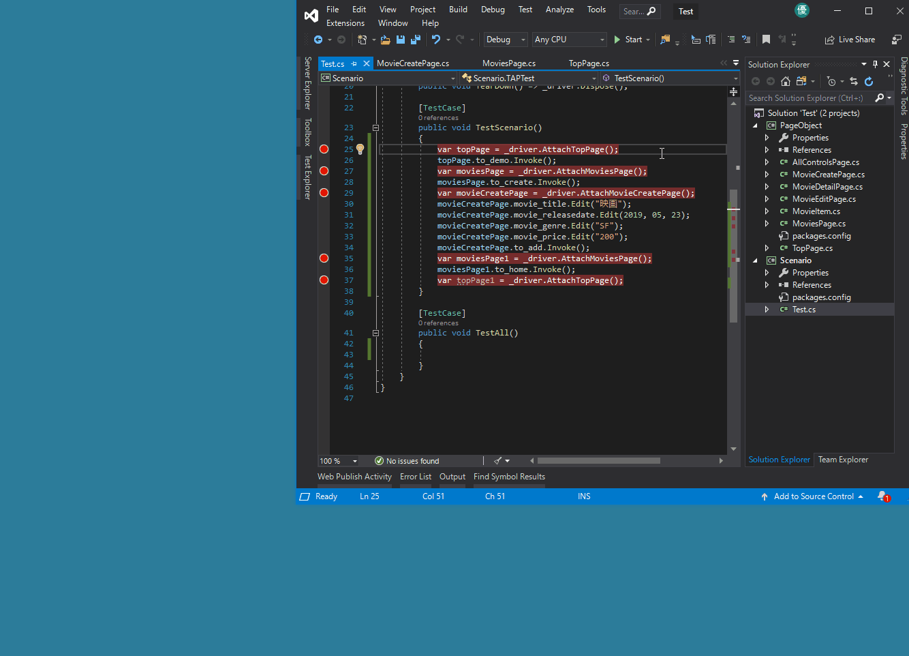

