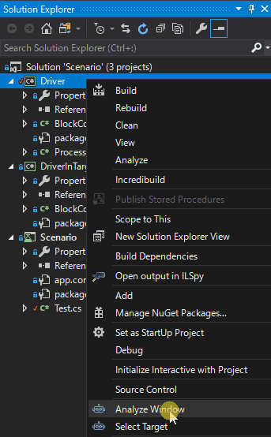
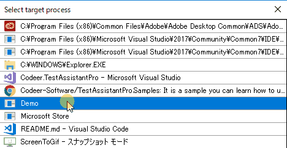
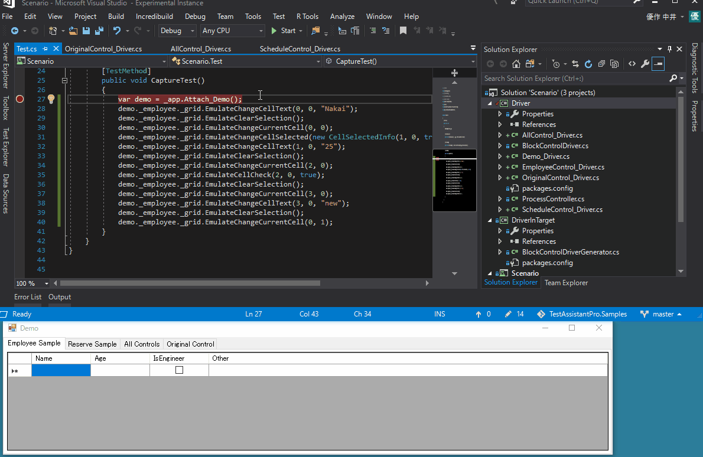

# WinForms Sample
It is a sample to experience Test.AssistantPro in the WinForms application.

Preparation
-------------
##### 1. Open and Debug build DemoApp/DemoApp.sln
##### 2. Open and Debug build Scenario/Scenario.sln
##### 3. Start DemoApp from DemoApp/bin/Debug/DemoApp.exe

Experience
-------------
### 1. Analyze Window
Right-click in Solution Explorer and execute "Analyze Window".

 

Select the application to be operated. Here, please select Demo.

 
 
"Analyze Window" displays all the controls in the currently opened window.
You can check the values ​​and properties of all controls.
If you want, you can change values ​​and properties in "Analyze Window".

 

### 2. Create Driver
You can create a driver for the control you want to operate with "Create Driver" in "Analyze Window".
You can highlight the control corresponding to each line.

 

### 3. Capture
Right-click within CaptureTest function of Test.cs of Scenario project and execute "Capture".
The operation method is generated with the code using the driver.

 
 
### 4. Debug and Execute
Right-click within any function of Test.cs of Scenario project and execute "Execute".
You can execute the function immediately.

 
 
Also, if you execute "Debug" you can debug using VisualStudio's debugger.

 
 
### 5. Advanced operation
First we have to learn about Friendly.
[Friendly.Windows](https://github.com/Codeer-Software/Friendly.Windows "Title")

In the case of nonstandard controls, you create the corresponding driver yourself. Using Friendly makes it easy to create.
```csharp
using Codeer.Friendly;
using Codeer.Friendly.Dynamic;
using Codeer.Friendly.Windows;
using Codeer.Friendly.Windows.Grasp;
using Codeer.TestAssistant.GeneratorToolKit;
using DriverInTarget;
using System.Drawing;

namespace Driver
{
    //Specify the full name of the corresponding type with ControlDriverAttribute.
    [ControlDriver(TypeFullName = "DemoApp.BlockControl")]
    public class BlockControlDriver : WindowControl
    {
        static bool _loaded;
        
        public BlockControlDriver(AppVar windowObject) : base(windowObject) => Init(App);
        public BlockControlDriver(WindowControl src) : base(src) => Init(App);

        //If you use Friendly's function, you can easily implement it because you can call the internal API of another process.
        public int SelectedIndex => this.Dynamic().SelectedIndex;
        public void EmulateChangeSelectedIndex(int index) => this.Dynamic().SelectedIndex = index;
        public void EmulateMoveBlock(int index, Point location) => this.Dynamic().MoveBlock(index, location);

        static void Init(WindowsAppFriend app)
        {
            if (!_loaded)
            {
                app.LoadAssembly(typeof(BlockControlDriverGenerator).Assembly);
                _loaded = false;
            }
        }
    }
}
```
If you also create a generator, TestAssistantPro will use it to generate the code.
```csharp
using Codeer.TestAssistant.GeneratorToolKit;
using DemoApp;
using System;

namespace DriverInTarget
{
    //A class that generates code when an operation is performed on BlockControl.
    //Specify the full name of the corresponding control driver type with GeneratorAttribute.
    [Generator("Driver.BlockControlDriver")]
    public class BlockControlDriverGenerator : GeneratorBase
    {
        BlockControl _control;

        protected override void Attach()
        {
            _control = (BlockControl)ControlObject;
            _control.SelectChanged += SelectChanged;
            _control.BlockMoved += BlockMoved;
        }

        protected override void Detach()
        {
            _control.SelectChanged -= SelectChanged;
            _control.BlockMoved -= BlockMoved;
        }

        private void SelectChanged(object sender, EventArgs e)
            => AddSentence(new TokenName(), ".EmulateChangeSelectedIndex(" + _control.SelectedIndex, new TokenAsync(CommaType.Before), ");");

        private void BlockMoved(object sender, BlockMoveEventArgs e)
            => AddSentence(new TokenName(), ".EmulateMoveBlock(" + _control.SelectedIndex, $", new Point({e.MoveLocation.X}, {e.MoveLocation.Y})", new TokenAsync(CommaType.Before), ");");
    }
}
```

 


