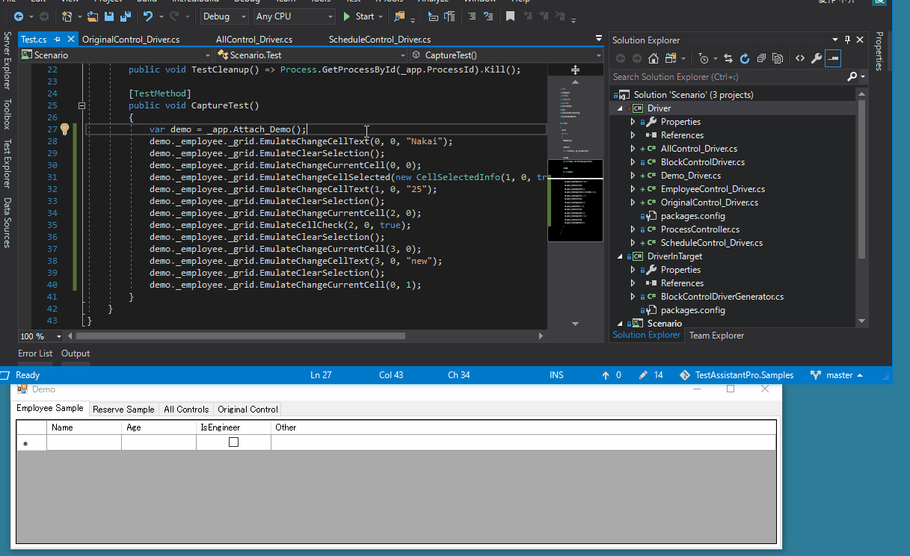

# WinForms Sample
WinFormsアプリケーションでTestAssistantProを体験するためのサンプルです。

準備
-------------
##### 1. DemoApp/DemoApp.sln を開き Debug でビルドしておきます。
##### 2. Scenario/Scenario.sln を開き Debug でビルドしておきます。
##### 3. DemoApp(DemoApp/bin/Debug/DemoApp.exe) を起動しておきます。

体験
-------------
### 1. Analyze Window
ソリューションエクスプローラでフォルダ（またはプロジェクト）を右クリックして"Analyze Window"を実行します。

 

操作するアプリケーションを選択してください。今回は"Demo"を選択してください。

 
 
"Analyze Window"は、現在開いているウィンドウ内のすべてのコントロールを表示します。
すべてのコントロールの値とプロパティを確認することができます。
必要に応じて、"Analyze Window"で値とプロパティを変更できます。

 

### 2. Create Driver
"Analyze Window"の"Create Driver"で操作したいコントロール用のドライバを作成できます。
各行に対応するコントロールをハイライトすることができます。

 

### 3. Capture
ScenarioプロジェクトのTest.csのCaptureTest関数内を右クリックして"Capture"を実行します。
操作メソッドはドライバを使用したコードで生成されます。

 
 
### 4. Debug と Execute
ScenarioプロジェクトのTest.csの任意の関数内を右クリックし、"Execute"を実行します。
すぐに機能を実行することができます。

 
 
また、「デバッグ」を実行すると、VisualStudioのデバッガを使用してデバッグできます。

 
 
### 5. 高度な操作
まず、Friendly について学ぶ必要があります。
[Friendly.Windows](https://github.com/Codeer-Software/Friendly.Windows "Title")

非標準コントロールの場合は、対応するドライバを自分で作成します。 Friendlyを使用すると作成が簡単になります。

```csharp
using Codeer.Friendly;
using Codeer.Friendly.Dynamic;
using Codeer.Friendly.Windows;
using Codeer.Friendly.Windows.Grasp;
using Codeer.TestAssistant.GeneratorToolKit;
using DriverInTarget;
using System.Drawing;

namespace Driver
{
    //Specify the full name of the corresponding type with ControlDriverAttribute.
    [ControlDriver(TypeFullName = "DemoApp.BlockControl")]
    public class BlockControlDriver : WindowControl
    {
        static bool _loaded;
        
        public BlockControlDriver(AppVar windowObject) : base(windowObject) => Init(App);
        public BlockControlDriver(WindowControl src) : base(src) => Init(App);

        //If you use Friendly's function, you can easily implement it because you can call the internal API of another process.
        public int SelectedIndex => this.Dynamic().SelectedIndex;
        public void EmulateChangeSelectedIndex(int index) => this.Dynamic().SelectedIndex = index;
        public void EmulateMoveBlock(int index, Point location) => this.Dynamic().MoveBlock(index, location);

        static void Init(WindowsAppFriend app)
        {
            if (!_loaded)
            {
                app.LoadAssembly(typeof(BlockControlDriverGenerator).Assembly);
                _loaded = false;
            }
        }
    }
}
```

Generator も作成すると、TestAssistantProはそれを使ってコードを生成します。

```csharp
using Codeer.TestAssistant.GeneratorToolKit;
using DemoApp;
using System;

namespace DriverInTarget
{
    //A class that generates code when an operation is performed on BlockControl.
    //Specify the full name of the corresponding control driver type with GeneratorAttribute.
    [Generator("Driver.BlockControlDriver")]
    public class BlockControlDriverGenerator : GeneratorBase
    {
        BlockControl _control;

        protected override void Attach()
        {
            _control = (BlockControl)ControlObject;
            _control.SelectChanged += SelectChanged;
            _control.BlockMoved += BlockMoved;
        }

        protected override void Detach()
        {
            _control.SelectChanged -= SelectChanged;
            _control.BlockMoved -= BlockMoved;
        }

        private void SelectChanged(object sender, EventArgs e)
            => AddSentence(new TokenName(), ".EmulateChangeSelectedIndex(" + _control.SelectedIndex, new TokenAsync(CommaType.Before), ");");

        private void BlockMoved(object sender, BlockMoveEventArgs e)
            => AddSentence(new TokenName(), ".EmulateMoveBlock(" + _control.SelectedIndex, $", new Point({e.MoveLocation.X}, {e.MoveLocation.Y})", new TokenAsync(CommaType.Before), ");");
    }
}
```

 
